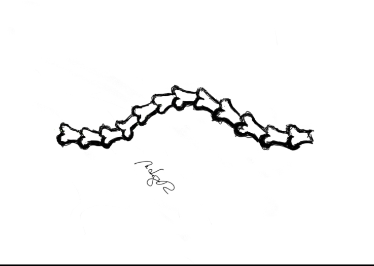

This is the best way to capture what the radiologist said about my spine. Yes, scoliosis. I have it. A C-type based on the x-ray slide she showed me. 

There's no direct explanation on how people acquires scoliosis. Some say its genetic or triggered by the person's environment but the sources I've read are not clear. I just feel victimized by how I learned about my situation. I had a medical inspection two months ago that included checking my back. Why was it not even mentioned? Is the medical community designed to conceal information until a certain case or problem is big enough to bring a patient back for profits? My case is not painful so it is not a big concern yet.

I normally reflect on death and how fragile our lives can be. That is why I do a lot of exercises to maintain a capable body. I eat food while being aware of pros and cons. I do not put sugar in my coffee. I love a strong and healthy anatomy because it equates to a powerful mind. Learning about my scoliosis, I now have a reason to do yoga which is a good thing. Did some specific exercises targeted for my case and I felt really good after. I still need to improve my core muscles so yeah this turned out to be a positive thing.

