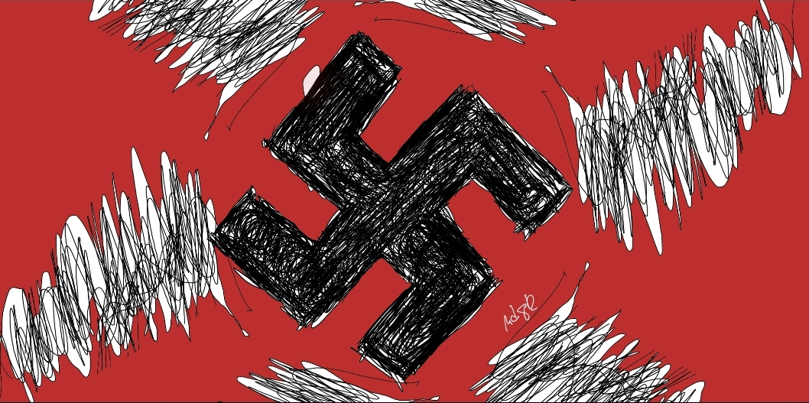

[Adolf Hitler](https://en.wikipedia.org/wiki/Adolf_Hitler) pushed humanity to the edge in World War 2. This was the period where violence became necessary, tremendous cooperation to kill a monster. But he is the same as us, biologically. He is from the genus homo. Same as you and me. He is an intelligent person - a WW1 soldier, politician and leader. [He even knows painting](https://www.google.com/search?q=artistic+talent+of+adolf+hitler&rlz=1C1CHBF_enPH738PH738&oq=artistic+talent+of+adolf+hitler&aqs=chrome..69i57.17292j0j7&sourceid=chrome&ie=UTF-8) just like the kid wielding his brush in an art class. But why such a person bestowed with tremendous talent, gravitating towards erradicating all jews on the face of the planet..?

Dr. Jordan Peterson explains to Joe Rogan in his [podcast](https://www.youtube.com/watch?v=USg3NR76XpQ) that all of us have the capacity to do good and evil. We are all made the same. We can be the camp guard or the prisoner in the concentration camps given the circumstances. We could have chosen the power to kill just to survive the worst of the holocaust. It is built in our genetic code. 

This makes sense as evil becomes necessary given the circumstances. When the threat of harm to another love one bestows infront of us, we will not hesitate to defend or create violence. He further explains that accepting this reality gives us more power to control our primal capacity. It will be easier to recognize evil once you accepted that you can become a monster yourself.

This had a profound effect on the way I accepted my last stint in investing at my friend's island in Palawan. He then had caused tremendous problems on my end. But the weaknesses of us humans is exploited in this events. Traditional thinking could have pushed me to destroy his businesses. But to what cost would it do? Destroy him just ending up becoming a monster so motivated only by money? I am not that kind of a person. 

I would rather start again than destroy great memories or families that depends on those businesses. I am more inclined to accepting the worst rather than becoming as evil as a man can be. Realizing that I have the capacity to cause hurt and suffering to another person gave me the barrier to which restricts my primal state. I can become a monster... If I choose to be one.

