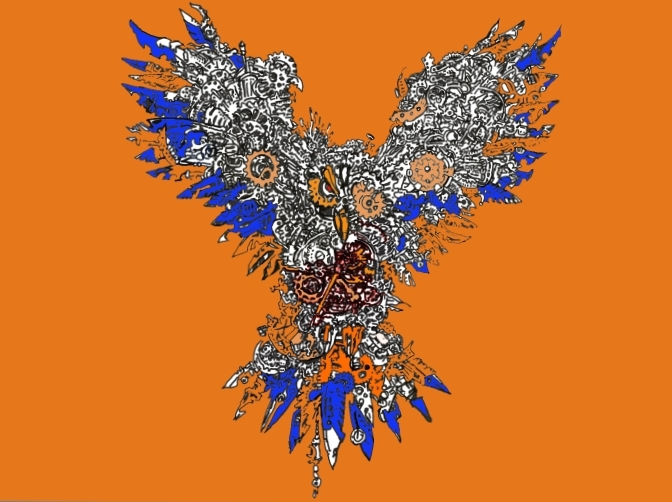

Each line, shade or dot used in this illustration wouldn't make sense individually to capture our awe. The combination of little things makes the whole to create awesome art. That is why small stuff matters - collectively.
This massive owl took me four hours to trace and copy. The original one was created by one of my favorites in the art world - [Kerby Rosanes](https://kerbyrosanes.com/). 

Yeah, small stuff matters - our bodies composed of billions of billions of cells, our brains composed of billions of nerves, the sun composed of billions and billions of hydrogen atoms, your computers built with processors that uses billions of nano-transistors and the list goes on. Our crazy life is built around atoms that interact and become big enough to become parts of our lives.

One of the most compelling concepts that took me to digging this theme was human behaviour. Since we are the most dominant force in face of the planet, it's very compelling to study how we operate and decide the fate our own and other species - as the [6th mass extinction](https://www.google.com/search?q=6th+mass+extinction+facts&rlz=1C1CHBF_enPH738PH738&oq=6th+mass+extinction&aqs=chrome.2.69i57j0l5.11999j0j4&sourceid=chrome&ie=UTF-8) currently taking place. 

How far did I get studying this subject matter to-date? 
* Evolution - Charles Darwin - Two billion years ago life started with microbes, half-billion years after this became fishes, hundred million years after - rodents, ten million years after - apes, million years after us - humans.. 
* History - 10,000 years of recorded history after the Agricultural Revolution, Industrial Revolution, Nazi germany, Gulag - Soviet union
* Intellectual minds - [Jordan B. Peterson](https://www.youtube.com/channel/UCL_f53ZEJxp8TtlOkHwMV9Q), [Robert Sapolsky](https://en.wikipedia.org/wiki/Robert_Sapolsky), [Robert Greene](https://www.amazon.com/Laws-Human-Nature-Robert-Greene-ebook/dp/B07C87SQ53), [Joe Rogan](http://podcasts.joerogan.net/), [Sam Harris](https://samharris.org/) 
* Coding - Web apps, Blockchain
* Astronomy, Physics, Chemistry, Biology

I believe the effort to deeply dive into these topics will take a lifetime..as new events are still shaping us - climate change, social media, [virtual reality](https://thenextweb.com/contributors/2018/04/18/9-ethical-problems-vr-still-solve/) and [automation](http://www.bbc.com/future/story/20170522-how-automation-will-affect-you-the-experts-view) - no one still knows how these massive events will creep on us and shape history.