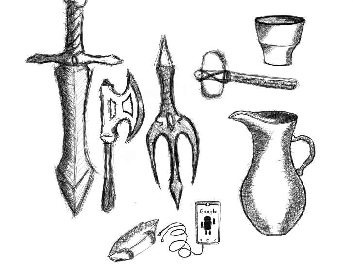

I use my personal laptop to code. I use my smartphone strictly for art and studies. I use YouTube, Udemy and Coursera to watch a lot of free courses. I use my profession as an accountant to earn money. I use money to support my mom and fund my experiments. 

Tools. We are not the only animals who could wield items. Chimpanzees use sticks to get termites from mounds. They use rocks for nuts, crushed leaves for water. True to fact, we were just so lucky to have discovered fire - this tool have given us enough to create warmth in cold climates (yes, we survived the ice age), defend ourselves from predators and most important of it all - the ability to cook food. 

In the book [Catching Fire](https://archive.org/stream/pdfy-DDoNCJJ_Wt0qOH7e/Catching%20Fire%20[How%20Cooking%20Made%20Us%20Human]_djvu.txt) I would quote: 

*"Those claims constitute the cooking hypothesis. They say humans are adapted to eating cooked food 
in the same essential way as cows are adapted to eating grass, or fleas to sucking blood, or any other 
animal to its signature diet. We are tied to our adapted diet of cooked food, and the results pervade 
our lives, from our bodies to our minds. We humans are the cooking apes, the creatures of the flame."*

 I don't like cooking but after learning this fact, I have utmost respect to our ancestral connection in weilding the pot and spatula. I should learn to cook properly..

Language is a tool that separates us apart from the animal kingdom. We can customize our thoughts through the amount of data that we can memorize and utter to our peers.

Money is a tool that we cannot live without. But the inequality around the world is commonly attributed to  We divide our world withstanding to the amount of riches one has. Statistics show that if you earn [32,400 USD annually](https://www.investopedia.com/articles/personal-finance/050615/are-you-top-one-percent-world.asp), you are part of the 1% of the world. The gap between the rich and the poor becomes wider and wider every decade. The lowest of the 23 poorest countries - Democratic Republic of Congo has an annual [average income of 394.25 USD](https://www.businessinsider.com/the-23-poorest-countries-in-the-world-2015-7).   

Going back to my opening statement.. not all people use the tools that I use in the same manner and yes its bad to ask them to do use them as I do. But bear with me. Most people see their jobs as their identity. I was like that before but when it came to a point that my profession is not responding as it was explained to us in universities to reasons beyond your control (eg. you got fired, poor management etc..) - the situation you are in will bite you. Personal computers are rarely used for productivity, most common use of it now to watch online videos or read social media posts. Smartphones are designed to allure us and consume our attention so specific platforms can run advertisements and consume our valued time. TVs bombards us too much of seemingly important news (eg. accidents, politics etc.) but true to fact, this do not help us at all. These are reasons why we should think of these aspects of our lives as "tools" and not as identities that represent us.

Our attention is a tool that is being mined by companies everyday. Never in our history that a few groups of people that have the capacity to affect the minds billions. We are in that spectrum now. Tools shape our culture. Tools mold our body - gradually, over long periods time. We developed a culture for cooking and in the process we acquired a brain capable understanding the world around us. I just hope that each people who have the chance to read this material would keep an open mind about how their actions compares to the past and how it shapes the present and eventually the future as this intertwine between our tools, culture and biology will determine our metamorphosis, our history moving forward.

