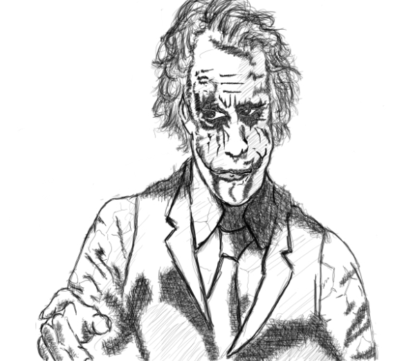

As a fan of *Batman*, the concept of having a clown as the main antagonist is so cool and crazy for avid followers like me. The title of this post is one of *The Joker's* most famous lines..in one of my most favorite performances in a [movie](https://en.wikipedia.org/wiki/The_Dark_Knight_(film)). But the question have been a theme lately as I'm often ask of it a lot (or a variation of the same question). 

The answer/s are complicated. I wonder how long this post will going to be..

Boredom and Focus. Realizing the value of mindfulness and stoicism in my life have taken me to a place to scrutinize my way of response to each information that my mind absorbs or creates. That's a long sneaky sentence but pretty much captures my point. I find true value in focused effort to improve instead of wasting time to unproductive habits. Nowadays its just so easy to become bored, just hold your smartphone and you'll never get bored - possibly forever. As I have said in one of my blog posts *small stuff matter*.

Regret and death. This is a core to everything I do. I deeply regret wasting time. What if I die tomorrow...what will I do to day if that's the case? Time is the most precious resource, we trade it for attention, money etc.. I regret having lived a life that other people forced into me.. Regret and death are powerful forces that most do not think about - until they are in the worst situations or the lying in the deathbed.

Truth. Being serious, focused and purposeful is living on the side of truth. If everyone would just read and understand what have happened in the past, I think there wouldn't be a need to create this blog post. History, as bloody as it may seem teaches the truth - knowledge fortified over time. I recommend this [resource](https://www.youtube.com/playlist?list=PL8dPuuaLjXtMczXZUmjb3mZSU1Roxnrey) if you wish to start learning more where you have come from..

Stability. Self-aware individuals create a stable nation. It is not the other way around, and will never be. This was well documented in the Gulag / Soviet regime - as all people stuffed their lives full of lies created a horror that will never go away and obliterated communism for the longest time. 

Health. Neuroscience explains a lot about how our body operates - each action powered by a single / group of hormones. There is incentive in doing things right and not half baked as these hormones reinforces what we do. Do a specific action numerous times and you have a habit. Do it a certain number years and it will a significant effect your health. 

Purpose. I believe that my purpose in this world is to make it better and impart the right values to the next generation. This requires tremendous effort, time and energy. This requires me to learn new skills. This requires me to seek refuge in a stable environment. This requires me to experiment. This requires me to love. 

Climate Change. This might be a controversial one to add. I find it troubling to find out that in this generation that I'm now experiencing...on the horizon is food shortages, war, famine, desertification, loss of all ice, extinction.. As I have said before... I do understand that we may die, but extinction is kind of hard for me to accept. The loss of science and progress that our species was able to accomplish is a big deal. 

I could add more to this list maybe in the future. It's not that long as I thought it would be but I pretty much added value in answering the question.. I hope people will start asking themselves the same question.. Why so serious? or rather why not?