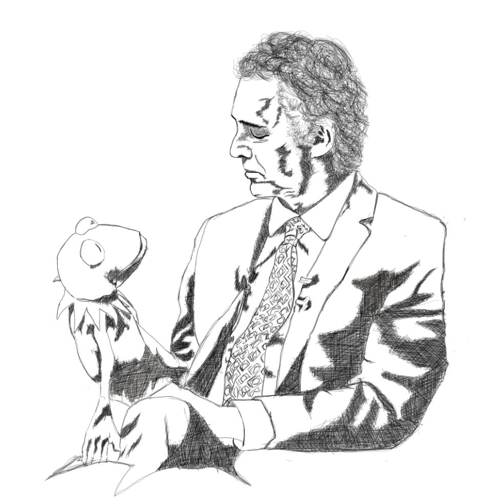

Thank you Dr. Jordan B. Peterson. You saved me from self-destruction. Made me realize how deep the world can be if I am really patient enough to understand it. Opened me up to the real world and how to start taking proper responsibility and transcending it to the younger ones. 

You should try his lectures. It's free! [YouTube Channel](https://www.youtube.com/channel/UCL_f53ZEJxp8TtlOkHwMV9Q)
* [Website](https://jordanbpeterson.com)
* [Self-authoring program](https://selfauthoring.com/)
* [Future Authoring program](https://selfauthoring.com/future-authoring)
* Support him in producing free content on YouTube - [JBP Daily](https://www.jbpdaily.com/) 
