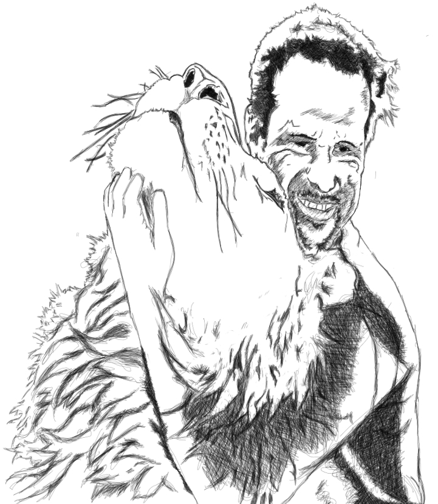
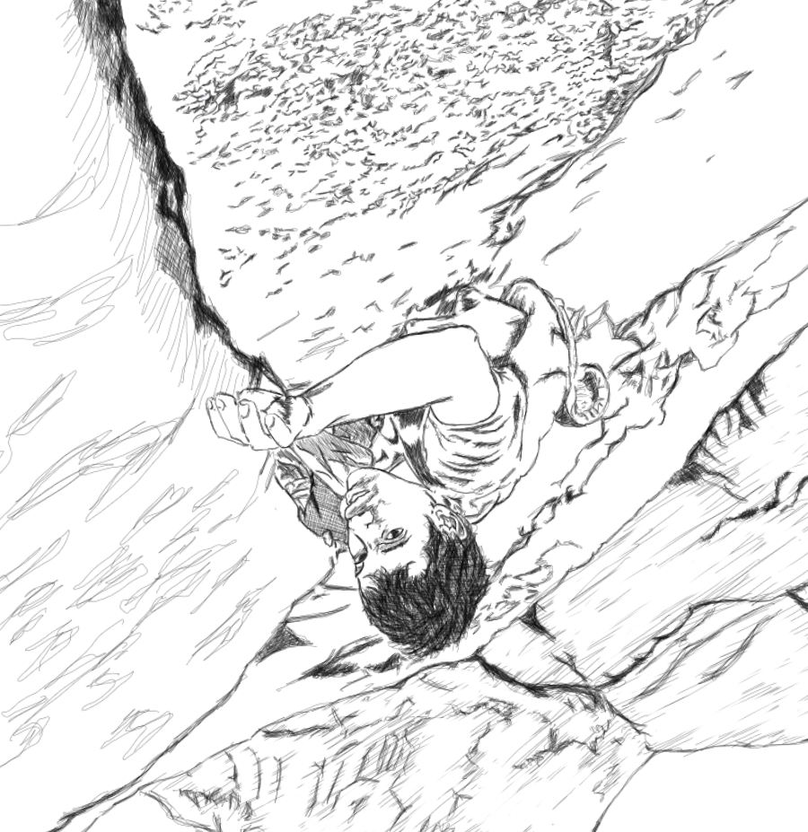
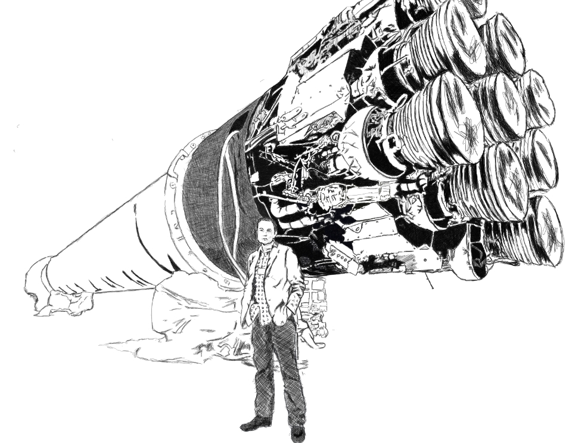

[Kevin Richardson's](https://www.youtube.com/channel/UC_NS4MiiHAFo3CYI7fRSLtQ) bond with animals always leave me speechless. He created a sanctuary for lions and hyenas in South Africa and creates a unique position for us all human beings - co-exist with wild animals in their natural habitat. 

Alex Honnold [ascent in El Capitan](https://www.youtube.com/watch?v=FRGF77fBAeM) is beyond comprehension. He climbed a 2300 meter vertical [mountain](https://www.nationalgeographic.com/magazine/2019/02/alex-honnold-made-ultimate-climb-el-capitan-without-rope/) without any rope or tools - just bare hands in under four hours..an inspiration for focus, courage and discipline!

Elon Musk combines all of the world's most cutting edge technology available to solve the burdens of the future - [AI](https://www.neuralink.com/), [Energy Infrastructure](https://www.tesla.com/) and [Space Exploration](https://www.spacex.com/).

I try to observe these types of people a lot. Talented individuals that either create or break the rules. Extraordinary ones who try to push the boundaries of how we humans operate. They exist and are alive in our lifetime. They give lightning bolts of energy & excitement whenever I see their accomplishments. Makes me proud that we are of all of the same genus homo. 

But..tremendous hurt, pain and suffering are still happening.

* ISIS still [rape women](https://www.google.com/search?rlz=1C1CHBF_enPH738PH738&ei=S1iGXOP0Jv7Tz7sP2-O70Ac&q=ISIS+rape+women+in+syria+and+iraq+news&oq=ISIS+rape+women+in+syria+and+iraq+news&gs_l=psy-ab.3...2297.3687..4461...0.0..0.420.1513.2-3j0j2......0....1..gws-wiz.l_AtamrdZmQ) in Syria and Iraq...
* Brazil's Bolsonaro is creating legilastion that will [destroy the Amazon Rainforest](https://www.google.com/search?rlz=1C1CHBF_enPH738PH738&ei=cViGXJueMY3az7sPlOSO6AM&q=bolsonaro+legislation+on+amazon+forest&oq=Bolsonaro+legislation+on+amazon&gs_l=psy-ab.1.0.33i22i29i30l2.141111.149944..150969...0.0..1.459.8067.0j5j19j4j3....2..0....1..gws-wiz.......35i39j0i131j0j0i67j0i131i20i263j0i131i67j0i20i263j0i22i30.1Azdx7anl1g)...
* Venezuela is [disintegrating](https://en.wikipedia.org/wiki/Corruption_in_Venezuela) because of its corrupt government...

There are people in this world that continue to push evil and no matter how much good we all accomplish including the likes of the Kevin, Alex and Elon - we won't be able to erase their dark impact. 

I never see ourselves as powerless whenever I reflect how far can our intellect shape the world.  But this power is a double edged blade. It cuts when one doesn't know how to weild his mind... part of our human nature is built to destroy. 

Whenever one creates crimes against humanity, we tend to remember it like the songs we sing in the halls of the churches. We are like Gods that either choose to create or destroy with the gifts bestowed with us - to the detriment or benefit of mankind and nature. 

Let us not forget that individual decisions - how ever small it may be shapes us today and the future of generations to come. It is now becoming more important for us to be mindful of our actions as climate changes is knocking at our doorsteps... more on that on the [next post](https://tech-stoic.github.io/uninhabitable-earth-david-wallace-wells/).	