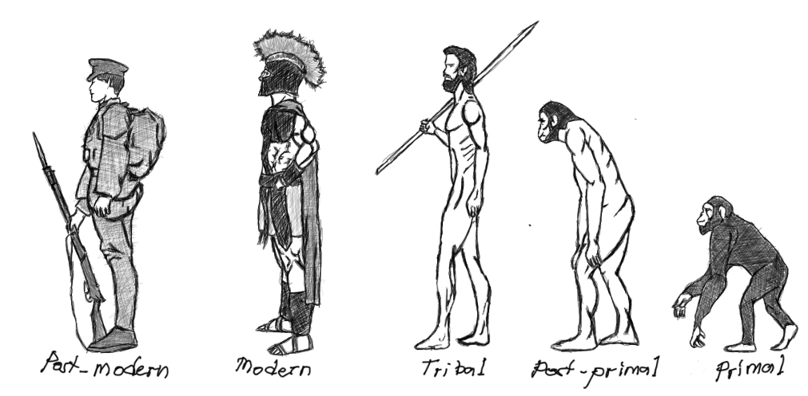

I truly believe that common sense is not common for most of us. You'll often get the impression from my blogs that I see most people as zombies..that is because I really do. A lot of us have become reactive to ideas, opinions or emotions without filtering the such first. I was like this before as well and it is not good. Rarely that I find people that thinks first how a certain topic originated first before making a response. 

I'll try to put each of these significant events that I have encountered in groups in order to map where in our human capacity we acquire a certain trait or physical attribute - forcing our adaptation in the process. Post-modern category is a little bit tricky because we still don't know much of how most of these concepts will affect our evolution in the future.

Primal:
* Evolution & Genetics
* Dominance Hiearrchy
* Communication 
* Violence
* Us vs. Them
* Sexual Reproduction
* Foraging
* Use of primitive tools - rocks, sticks

Post-primal (3.6 million years ago):
* Walking with two feet, standing straight
* Running/ Bi-pedalism
* Scavenging
* Hunting
* Early communication through sounds and gestures
* Use of basic tools - sharp rocks, clubs 

Tribal:
* Language
* Discovery of fire
* Cooking
* Organized hunting and foraging
* Curiosity
* Symbolism
* Cave Painting
* Wood crafting - spears, bow and arrow
* Trade / Barter
* Early Religion and Supernatural beliefs

Modern (12 thousand years ago..):
* Agriculture
* End of Natural Selection
* Philosophy
* Modern Religious beliefs
* Money
* War
* Tax
* Colonialization
* Science
* Mathematics
* Rise of States
* Printing Press
* Marxism
* Capitalism
* Racism
* Genocide
* Classic Liberalism
* Immunization
* Industrialization and Fossil Fuels
* Physics and Astronomy
* Motion-picture
* Pareto Principle
* Bombing of Hiroshima

Post-Modern (After WW2):
* Nuclear Energy
* Golden Rice
* Transistors
* Birth Control
* Extremism
* Internet
* Terrorism
* Social Media
* Radical Left and Radical Right
* Victim vs. Oppressor
* Post-Truth
* Machine Learning and Artificial Intelligence
* Space Race
* Climate change
* Renewable Energy
* Minimalism
* Fermi Paradox

Whatever we do, use or say in this world... has a history so intricate that everyone I believe should atleast educate themselves in order to navigate our daily struggles. I'll keep updating this blog as I think there is much to add in this list.