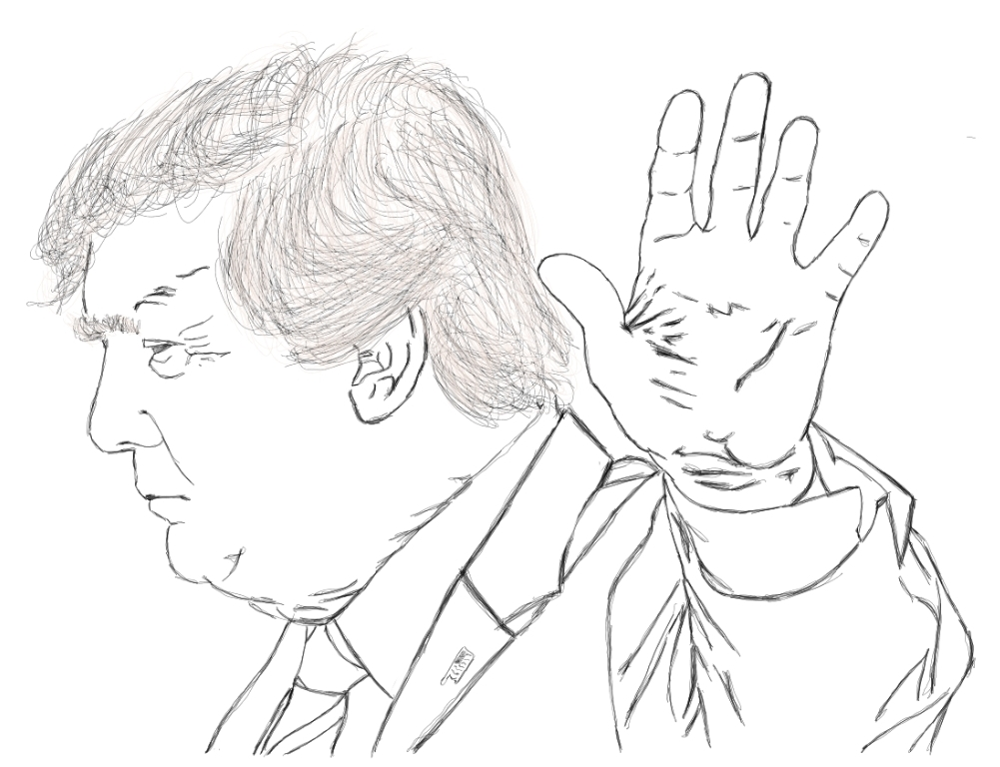

Wherever you live in this world, Donald Trump has affected your life in a way, mostly bad.Okay let's start pumping stress hormones to your bloodstream (Sorry!):
* <b>The power of social and mainstream media.</b> His election inarguably was won through his marketing skills (He's great at it to be honest), maintream media kept highlighting all of the stupid things that he say all day - non-stop. That is crazy to think that he got around 2 billion dollars worth of free publicity through his rethorics. Social media magnified the problem through its ability to consume people's attention 24/7. This big hole it caused in history can never be forgotten. It showed that our ability to think and analyze has gone down dramatically. Another example why I keep saying most people are like zombies nowadays. I got in to a heated argument with a girl from USA in Thailand before (Jan 2017) by just explaining how I have perceived of him winning the election against another bad apple - Hilary Clinton. This bullet point is the reason.
* <b>Lying becomes the new normal.</b> He is insane, not insidious - yet. He keeps talking about building a wall to guard against Mexico from bringing drugs and guns to his country. He speaks of it like it is a crisis that his country needs to pay attention, painting a picture of dire state of emergency but yet he still keeps golfing on the weekend for 6 hours.. His delusion about what he wants to promote as a right he acquired from winning the oval office is so amazing and stupid at the same time. The strongest economy in the world is being ran by a guy that is the king of lies.
* <b>Climate Change Denial.</b> This a big one. He is pulling civilization back just by denying climate change. It would be okay if he is just a president of a small country but it's not the case. He is supposed to be the most influential person to address the doom we are in and yet he keeps on protecting the fossil fuel industry. We all know that there is tremendous money in it for him to do such but is it really worth it? Going to be written in the history books that you are one of the most stupid person to walk the face of the planet? ow men this one literally burns people as a lot die of heat waves all over the world. It's not that he's to blame to all of global warming but come on - power is supposed to be used for the good in the modern times and not to serve certain groups of people.

It's not all bad with the "Donald Trump Effect", Let's talk about how he is somewhat causing some good in the world..

* <b>Intellectual Dark Web and Podcast.</b> [IDW](https://www.google.com/search?rlz=1C1CHBF_enPH738PH738&ei=udKIXJ3VHfGzmgeztrioBA&q=intellectual+dark+web&oq=intellectual+dark&gs_l=psy-ab.1.0.35i39j0l9.23335.33293..34508...1.0..0.896.3476.0j1j5-3j2....2..0....1..gws-wiz.....6..0i71j0i131.KpvsnsAN9ak) is a group of amazing people who focuses on making sense of what is happening all around us. They could be the replacement for traditional media as the knowledge that you can acquire for them is really worth your time. I personally follow [Dr. Jordan B. Peterson](https://tech-stoic.github.io//dr-jordan-b-peterson-part-1/), [Sam Harris](https://samharris.org/), [Bret Weinstein](http://bretweinstein.net/) and [Joe Rogan](https://www.youtube.com/channel/UCzQUP1qoWDoEbmsQxvdjxgQ) as they do this talks that is so amazing and their arguments becomes tools that fortifies my view about the world. I also listen to a bit of Jocko Willink's [podcast](http://jockopodcast.com/) for he has a lot of sensible arguments to reflect upon. And most importantly..
* <b>People are waking up.</b> People are taking notice of how cruel and stupid the world is through Trump's rise to power. 
We do need a good picture of the future to some extent so naturally we seek for people who can help us and that is what I think is happening.
People now are like seeking for alternative sources of information (like the IDW) to make sense of what is happening. 

Trump is still in power for approximately two years and He is still writing history as we know it. My personal advice to everyone: go deep into the topics that run your life.. this is really hard because all the things that take away our attention is inside our smartphones and it is so easy to err on the side of simplifying our understanding. Technology have created all of the world's convenience for us to benefit from but I believe it is hiding the bleak picture that we are getting dumber and dumber that is why people like Trump can shake reality to its knees. 