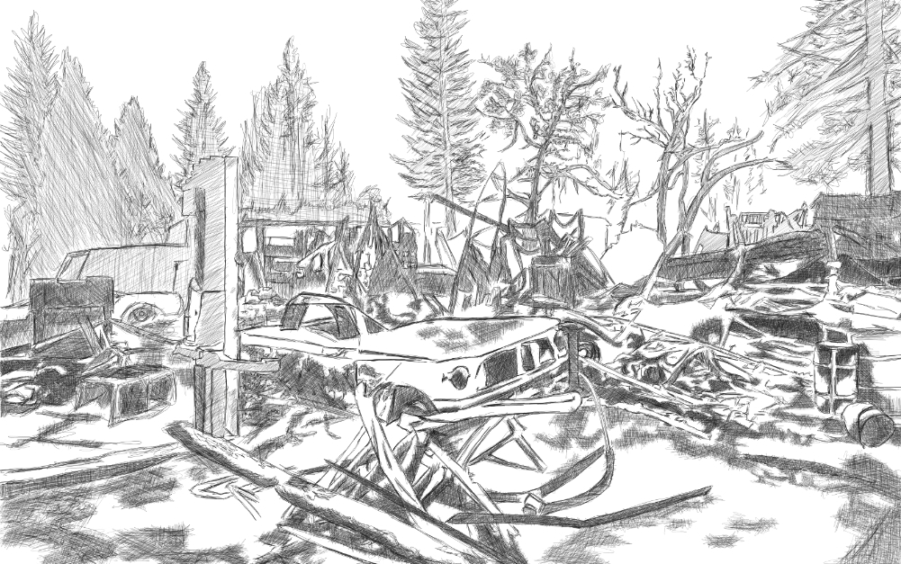

Physics. Fire is a chemical reaction. Virtually anything in this world can burn given the right circumstances. Those conditions were met last [November and December 2018](https://en.wikipedia.org/wiki/2018_California_wildfires) in various places in California. How big of a deal were the California Wildfires?

* Total fires: 8527
* Total area affected: 766,439 hectares
* Total cost of damages: 3.5 billion USD
* Lives lost: 98 civilians, 6 firefighters 
* Non fatal-injuries: At least 80 people

I visualize this happening in other parts of the world and to my suprise a few weeks ago as parts of the mountains in the province of [Benguet is burning](https://www.gmanetwork.com/news/news/regions/456209/benguet-forest-fire-on-and-off-since-march-8/story/). We are also encountering the [longest water shortage](https://www.rappler.com/business/225837-mwss-says-duterte-wrong-advice-manila-water-mess) in decades in the Nation's Capital. What is alarming for me is the misreporting of traditional media regarding this climate changes we are encountering. It's a global event, available in the internet to study but these establishments where we entrust our lives with information is basically not doing their jobs.

I guess the thing with not telling the actual has some incentives. People are not in panic mode and society will still function normally as intended. It will trigger massive changes for public infrastructures and would affect all current plans of the government. But is it really worth the price of not telling the truth? Putting the lives of innocent people on the line just to preserve temporary stability or personal  gain? I think only time will tell how much damage will these kinds decisions affect millions of people in our country. 

I also fear that a lot of countries where corruption is pervasive in their government and traditional media structures, that the same conditions are happening - concealing information regarding climate change for the benefit of a few groups of people. How insane could this be? 