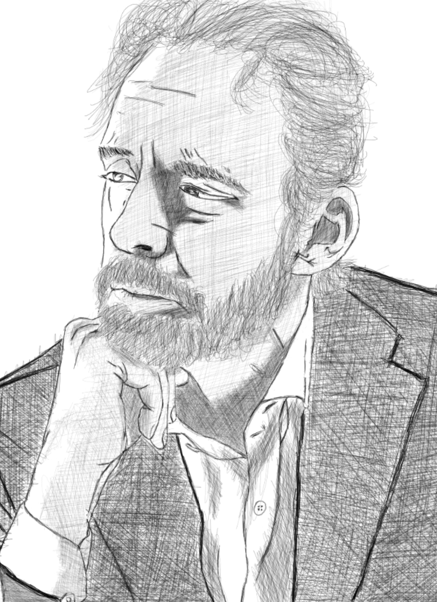

This is my second post about Dr. Peterson. If you want to see that short thank you blog and links to his amazing content, please check this [post.](https://tech-stoic.github.io//dr-jordan-b-peterson-part-1/)

I had seen our family crash down, experienced the worst with how things can be - like almost dying (twice in a span of 2 years) and even did a project that helped a family in the islands but eventually turned their back on me.. It is clear to me that there is no one size fits all to every situation - good or bad but I was always hitting walls wherein I could not understand reality itself. I knew at the back of my head that there is something wrong with how the universe operates but unfortunately I can't specifically point out what it is.

Also, we are currently entering to a new stage of society wherein all of the world's great treasures are at our access - information, technology, good health.. As younger generations tend to disconnect from bloody history, I wonder what challenges would our generation face that will have significant importance.

Enter Dr. Jordan B. Peterson..

If you have watched the movie Avengers: Infinity Wars where this scene wherein Thor came back to earth and [threw his hammer to Thanos](https://www.youtube.com/watch?v=k0A5cMcNHs0) and then this villain said "You should have aimed for the head.." - Dr. Peterson quite got me on some level where he have hit the holes in my belief that resides in my head for the past decades.. some even when I was still a child, kind of what Thanos had in mind inorder to stop himself.

His book [12 rules for life: an Antidote to Chaos](https://www.audible.com/pd/12-Rules-for-Life-Audiobook/B0797YBP7N) is a great overarching structure on how one should fortify his belief in life. Believe me, I was that guy who used to think that know everything and have read tremendous amounts of materials regarding self-improvement but after listening to him - I realized that I was just scratching a dust from Disneyland in regards of what is truth and the horizon of potential. 

There is so much seemingly simple things that run our life that is complex enough to deceive us until we die. His arguments lets you in that kind of narrative. Like how some parents are strangling their children's future through bubble wrapping them from how crazy the world is. As a keen oberver of parenting patterns, this hit home in my beliefs. 

Tell the truth. Even though I try to implement this over the track of my life, unfortunately it is rather difficult to not hurt people as we strive to exist as truthfully as possible. Truth hurts pretty bad. Well, as Dr. Peterson said in an [interview](https://www.youtube.com/watch?v=aMcjxSThD54) "In order to be able to think, you'll have to risk being offensive.." which cuts to what the value of truth in our lives should be - an act of courage to reveal reality..whatever the consequences may be..

He also speaks from his 30 year tenure as a [clinical psychologist and lecturer at the University of Toronto](https://en.wikipedia.org/wiki/Jordan_Peterson ) that good and evil resides in all of us. This quite needs an evolutionary perspective to make sense but this topic is so crucial to everyone or rather anyone who likes a stable civilization. In order to manage yourself in difficult situations, you must internalize that you yourself can cause great harm than good. I personally applied this to what happened in Navotac as there is no point in destroying the project because they deceived me in their promises. I thought of the people who depends on the project. Kids that would be hurt if I push through the monster that I can become just to retrieve my investments. 

I'm now listening [Maps of Meaning](https://www.amazon.com/Maps-Meaning-Architecture-Jordan-Peterson/dp/0415922224).. which is his first book that he used to decode how can the horror of the past (Nazi Genocide, Stallin/Gulag) won't rise to power again. Its quite a strong book to consume because it grounds from a lot of disciplines..mostly psychological, philosophical, historical and religous in context. Still digging with it as of this writing.

Becoming a good person is tremendously hard.. but with the minds of people like Dr. Peterson things get clearer and complex but rather puts us in a path where the difficult could be achievable.

