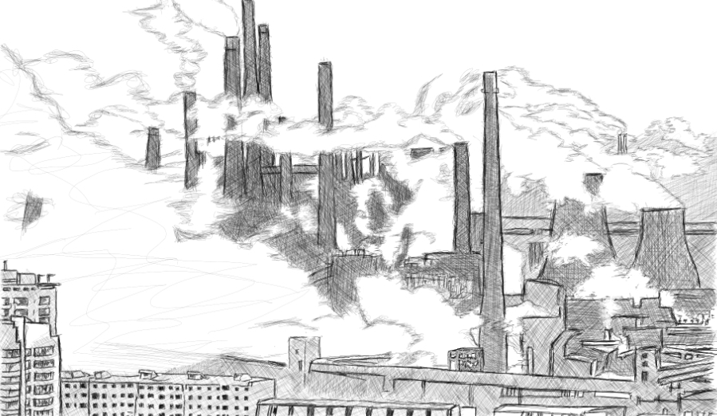

<b>Again.. stress alert.. do not read this if you have significant depressive states.. you have been warned</b>

Don't get me wrong. I love capitalism. I enjoy the benefits of a society built by talents, education, tech and progress coming from enterepreneural pursuits. Never in our lifetime have existed 7.7 billion people that can enjoy the resources of this planet and harness it to improve our living standards without the threat of war. It is truly amazing to live in this moment. Even a guy like me can learn about anything, use rectangular boxes called computers to code and communicate information through websites and publish it through servers and making it accessible through smart devices within a few clicks. 

But yet I have fears that capitalism is the way forward into the future. Eventhough our civilization's best attributes are built on this concept, I still see its flaws now revealing itself. It is truly scary but enlightening at the same time.

My firsthand experience with capitalism in Africa is not my best performance as a human being. I'm not proud of helping a governmnent official steal oil from his country's public resources and transfer it to his personal business. I would not specifically name who is the people involved to promote safety of others still working with them. Capitalism became a way wherein corruption got out of hand all over the world. Even in the Philippines, the main source of all evil and poor progress is - yes, corruption.

Capitalism enabled tax evasion strategies. Transfering wealth in various tax havens all around the world became a mechanism for rich heads of states to filter out significant funds that they have earned or stole from their countries. This money could have been used to improve third world economies but instead pooled out of their countries for personal gain.

Capitalism also have introduced social media wherein everyone created a web of information that seems to be reality. Most people get their knowledge from Facebook, Twitter & Instagram  and what is scary is that data in these platforms are largely unverified.

Capitalism also hides the layers of history. It is so easy to believe for the younger generations that the world is a static ball of happiness and abundance. The age of our specie is around 250,000 years and the age of stability that we currently have is just 50 years!!!

Lastly, capitalism paved way for these particular events wherein Exxon Mobil and Shell executives hid the [devastating effects of fossil fuel use](https://www.theguardian.com/environment/climate-consensus-97-per-cent/2018/sep/19/shell-and-exxons-secret-1980s-climate-change-warnings) and thus increasing human caused global warming and climate changes. The effects of [one single memo](https://www.scientificamerican.com/article/exxon-knew-about-climate-change-almost-40-years-ago/) produced by the executives of this company is so catasthropic that it will change the path of history forever. This is a [video](https://www.youtube.com/watch?v=TbW_1MtC2So) on how we got in these mess we are in.

I overused the word capitalism here because I'm trying to paint a picture that this is so far the best that our society have produced to harness our human capabilities and solve our daily struggles - but its not even perfect at all. Capitalism goes deep, because of the freedom it allows people to create virtually anything. But the downside of it is it doesn't factor nature - resources and negative impact and also it shows how exposed we are from insidious desires of the few to manipulate the future for personal gain.

Civilization is continously transforming itself and we might be in a time that we need to improve the way we operate virtually everything.. 

