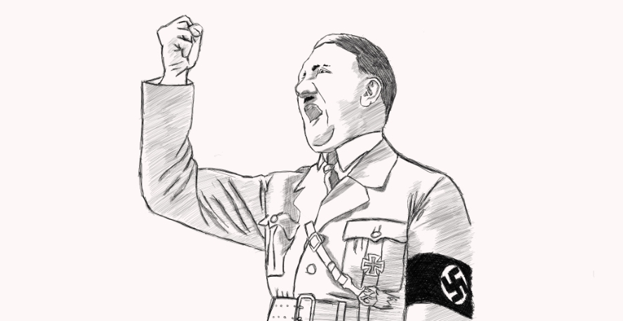

 	

My fascination for human behavior is endless. I have been studying this topic for two months already and still I want more of it. It brought me to interesting paths of empathy towards people that caused me great harm and allowed me to reflect a lot with how I handled my decisions in the past. But another thing that strikes me the most is that our human capacity to coordinate with each other and create chaos against groups of people to whom we are not affiliated with... our capacity to start and implement wars..

Wars are one of the worst tools ever wielded by humanity. We are not the only animals who can band into groups and destroy other species but our degree of sophistication in implementing violence and destruction is unfathomable. We can create guns that allows us to eliminate targets with precision. We also created economies for private armies, armaments, ammunition and the list goes on. Cyber attacks and social media campaigns being carried out by nations to distabilize others. 
Another thing to mention are nuclear bombs / nukes hidden in the ocean through submarines. We are really too technologically powerful nowadays to the point that I wouldn't be suprised to see robots weilding lasers in the future carrying out. 

But deeply reflecting on the significance of wars in history have taught me a few good things that I believe everyone should know..

* It teaches gratitude. Living  peacefully at present beacause people fought for it in the past is truly empowering. The energy that I get whenever I rememember that our history is covered in blood keeps me going, trying to do more in every situation. 
* It brings out the heroism of the few. This is what also frames history. Those few ones who used their skills, intellect and will to survive and fought the evils of our kind. Winston Churchill stood up against Adolf Hitler in the 1940s during the World War 2. I wonder where would humanity be today if he didn't had the courage to stop the horror of the Nazis? I clearly see more deaths..
* It drives technological improvements. It's hard to imagine a world without the internet, computers, weather systems, gps, digital cameras, ambulances etc. We enjoy the benefits of these things because of the drive for innovation in support of wars. 

No one can escape the strands of impact wars have created. It intertwines us all, more and more as we thrive now in a global economic stage. What I discovered after studying our behavior and history is that wars are a big part of our ancestors daily lives. With climate change knocking at our doorsteps and neverending conflicts in Sub-saharan Africa & Middle East, I honestly fear that the kind of garbage information being injected by social media to the public will spiral and trigger the death of billions of people if the worst effects of climate changes hits us all.