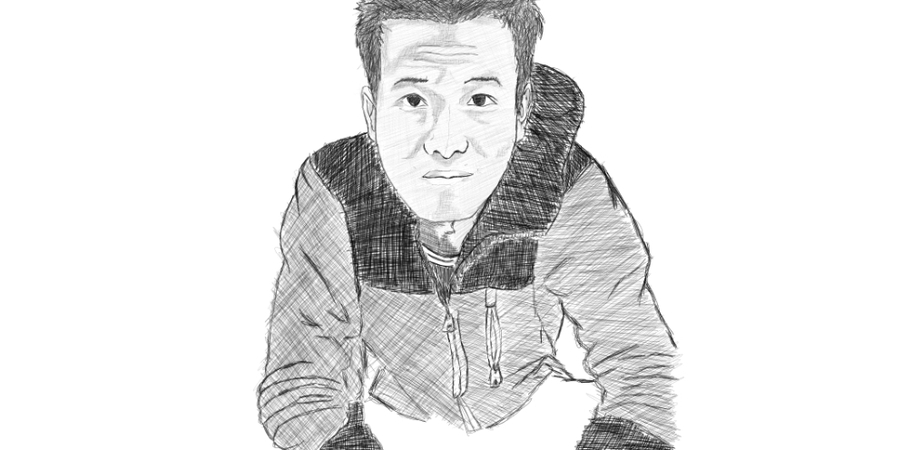

 	

Pursuing the meaning of life was a constant problem that I was trying to solve, I thought the answers were either getting absolute "peace" or creating projects out of "passion". In the process of it, I experimented with a lot of learning techniques and partnerships in pursuit of enterepreneurship but unfortunately, it came to a point that I hit the walls. That lead me to rethinking the whole process again. Then Dr. Jordan B. Peterson's [discussion on responsibility]() gave a new impression on cracking the code of this predicament - the responsible individual trumps the passionate ones..

At an early age, I somewhat accepted that people's journeys are very different. There is no one size fits all. The problem with my way of thinking at the time or even as an adult is I do things without proper philosphical foundation for my decisions. I tend to do things in a haphazard way...

I have been responsible enough for my actions for most of my adult life. I've been into relationships with women that I thought that I would marry but ended up not getting to and I took responsibility for everything (predominantly at most are bad) that I can absorb. I have been entangled in entrepreneurial pursuits and manage all sorts of deals along with it. I have been truthful in every single word that I say and it reciprocated with the authentic responses from people - business partners, workers, creditors and potential investors. Living with words truthfully lets one navigate the good, the bad and the ugly. I took responsibility for being the head of the family for my mom and my brother after my dad left our family years ago. He's back with us now but I am still operating my life as the person on top of the curve for putting the food on the plate for the long-term basis. These core principles were my meaning of responsibility at its core.

The Divine Individual as described by Dr. Jordan B. Peterson is grounded on individual responsibility - which was very different from my way of thinking. By what that means is don't be a victim, pick yourself up and go set face your own suffering and if you help yourself get better, everybody around you gets better. He further explains that a society filled with responsible people is the strongest, robust enough to cast a shield against the horrors of our past. His obsession to debunking the Nazi and Gulag evil got him to this point that to control mass amounts of people, the power must reside with each person and it shouldn't reside in a single or few number of individuals.

He further grounds responsibility as acting it out while keeping in mind that life is a series of games that we have to play. Step by step, each small action we take moves us a little bit upward, and a little bit more, repeating it again and again. He is famously noted for his analogy of cleaning up your room, that starting with the smallest part of your life that you can fix is the one that you start solving which most of the case is the environment around us, may it be your room or office.

Another idea that grounds The divine individual is that "all human life has intrinsic value". I have found out that this is a very daunting and worthwile chase to extend another generation of science, technology and values. This in effect my next task transcend this message in my life. I think it will start with my relationships - my wife, friends and co-workers for now, maybe in the future are bigger sets of groups people. 

I am taking little steps, as little as possible.

But first I got to find her first..big task I believe. I'm expecting my OEC today that will finalize my tickets to Cayman Islands. I just really hope that she is there in KY.:-)