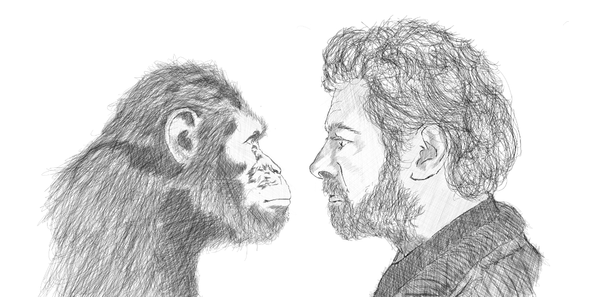

We came from apes.

For the large part of my life, I ignored this idea that we are hyper-evolved chimps that can do a lot of cool stuff. A young kid born in the only catholic country in Asia do have a lot of drawbacks. Catholicism forbids one from believing in this. But now that believing in science and history have paved ways for me to better understand the world specially our species..there is no reason to stop learning more about us. 

So I'm reading a lot of books, namely:

* [Sapiens, a brief history of human kind](https://www.amazon.com/Sapiens-Humankind-Yuval-Noah-Harari-ebook/dp/B00ICN066A) by Professor of history and futurist [Yuval Noah Harrari](https://www.ynharari.com/) placed the first layer in my brain for questioning the world around us. He definitely explained everything we have accomplished in a single narrative. A required reading for everyone.
* [Behave, the biology of Humans at Our Best and Worst](https://www.amazon.com/Behave-Biology-Humans-Best-Worst-ebook/dp/B01IAUGC5S) by author and neuroendocrinologist [Robert Sapolsky](https://en.wikipedia.org/wiki/Robert_Sapolsky) framed his powerful curiosity in debunking what happened with Adolf Hitler - how an highly intelligent person forced the death of 6 million jews in World War II. This is one of my favorite books for understanding people in general. 
* I haven't finished the book [Maps of Meaning](https://www.amazon.com/Maps-Meaning-Architecture-Jordan-Peterson-ebook/dp/B000FBFG80) by [Dr. Jordan B. Peterson](https://tech-stoic.github.io/dr-jordan-b-peterson-part-1) but this is a deep dive on how we humans basically "think". It outlines how this process have been forged by stories from our ancestors, the bible and our own biology. I still haven't finished this and yes this is a very difficult book to consume. I really need to finish this one..

I have taken tremendous amounts of information in the last nine months... still I'm forcing myself to dig even deeper in the search for meaning - how have we came about to be the most dominant force in history and how will our species survive the future - climate change, automation & AI. This two questions drives me everyday in the pursuit to build more skills and resources.

BTW. I'm already in Cayman Islands..:0)