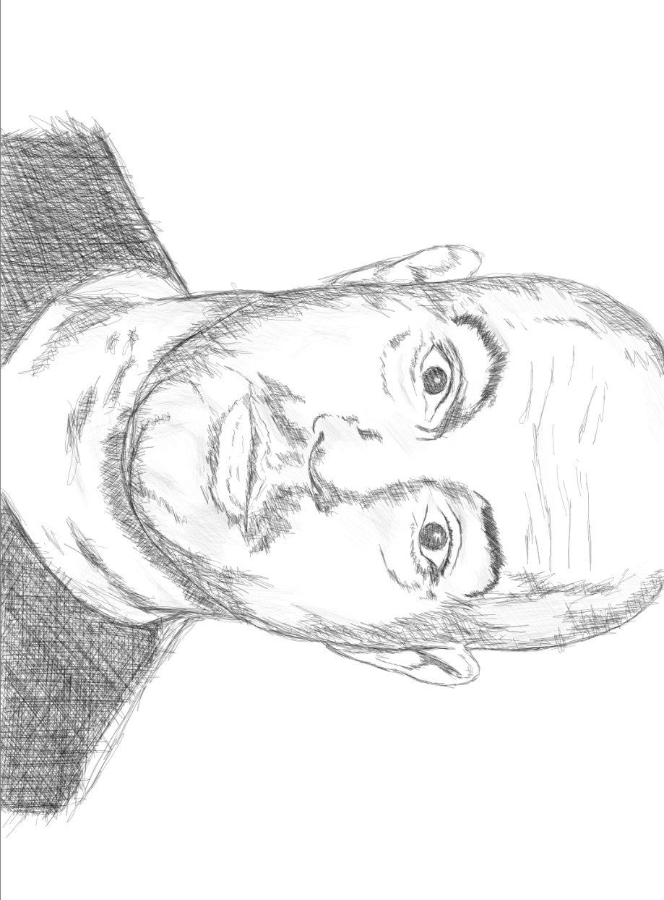

Some of my blogs have talked about the Intellectual Dark Web and persons included in this group.
One of them is Mr. Joe Rogan - a comedian & MMA commentator in UFC which most famous for his podcast ["The Joe Rogan Podcast"](https://podcasts.joerogan.net). I love this podcast as a resource of all of the briliant minds of our time to name some like Elon Musk, Neil DeGrasse Tyson, Dr. Jordan Peterson, Sam Harris, Ben Shapiro and many more of which helps me to make sense of some of my own intellectual brain curiosities as these sorts of people exemplifies the truth and profound ways of viewing the world. 

His four episodes with Dr. Peterson is one of my favorites because of the amount of value I was able to acquire from Dr. Peterson's arguments and how the flow of great concepts on how we humans basically evolve to understand the world. 

I like how he interviews his guests as he allows them to talk in their own natural way. I also like his views on our primal nature - he really is fascinated with monkeys. 

I'm looking forward to intellectual conversations being put up in the interweb by Joe with his guests as he focuses to bring truth on the most interesting topics of our generation - artificial intelligence, climate change, universal basic income, darwinian theory / evolution and human nature. 

More episodes to come Joe! 

Link to his [YouTube Channel](https://www.youtube.com/user/PowerfulJRE).