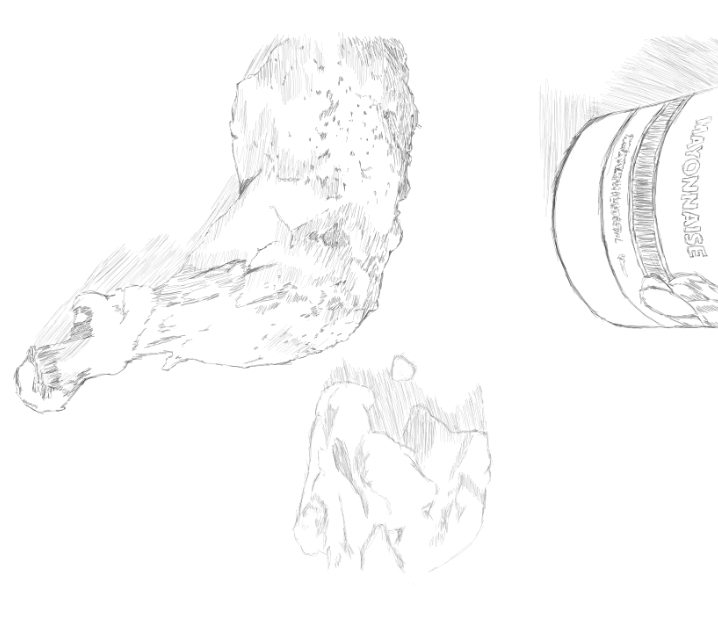

For almost two weeks now I've been eating only meat products plus some avocados and kale. Fried slices of pork, chicken, salmon, some beef - mixed with tons of mayonnaise, avocado ice cream with unsweetened chocolate, sunflower peanut butter and coconut oil. Saturdays are hard because our office caters free lunch so I have a cheat day for eating some bread but predominantly it has been just proteins and fats. 

Why do this crazy experiment? The rewards of the ketogenic diet outweighs the cost of it...I think.

What rewards?
* Activating the mitochondria's capacity to harness ketones produced by the liver as a source of energy. Primitively, we have this capacity but became dormant when we started the "Agricultural Revolution" - 12,000 to 10,000 years ago and started consuming a lot of carbohydrates.
* Fats converted as ketones are a better source of energy for the body - I was cycling around 14.4 kilometers per day for a week during this period and encountered less fatigue.
* Cognitive load increase is observed from people adapting the diet since it is recommended to people with Alzheimer..
* Less hunger - only once that I have encountered hunger after I tried a 14-hour fasting.

What am I sacrificing for this?
* Despite the abundance of food choices in Cayman Islands (almost all of the essential food items for the diet is available here), I do encounter some sadness for I cannot eat our usual filipino cuisine - as most of what we love back home is tied in some way to carbohydrates-based-meals.
* Cost is a little bit of an issue - at first. The process is highly experimental and I'm still getting used to what to buy, combine, cooking methods (a lot of my food is fried with coconut oil) and storing food.
* A ton of explanation to people. Not that I hate explaning what I do but it could be a downside as normally people may think differently of what you do. Human nature.

I intend to push this diet as far as I can as it speaks a lot of our primal state - our early hunter/scavenger ancestors relied heavily on fats and proteins for energy source and thus suggesting evolutionarily pertaining to our genetic make-up relying on this frame of energy mechanism. The 12,000 years of reliance to agricultural products is very miniscule to our 2.5 million years of existence as homo sapiens so the ketogenic diet really could play a vital role for my health moving forward - as I see some recent studies relating high sugar intake associated to cancer and not to mention the overwhelming case of diabetes and obesity.
