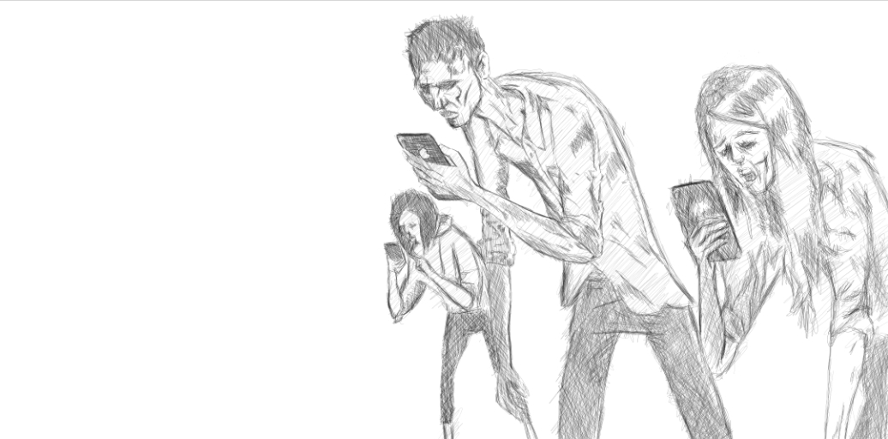

I still have Whatsapp for work and friends from Ausralia & France, use Slowly to meet new people, use Twitter to follow people for knowledge & climate news & use Messenger for interacting with some close friends and my Mom. So technically it's not zero for me but, could be 95% of the time I was devoting to Facebook, Instagram, etc has been reinvested to learning new skills and cycling.

Social media is unavoidable for most people nowadays but unfortunately, I see it making our generation more dumb than the previous ones. 

I'd rather have laser type focus than losing time to dopamine & cortisol surges from browsing social media posts of other people. I believe this is a more better way of making sense of our limited time in this world. Blogging is a more intellectually stimulating routine looking at my friend's photo. I wish most will be able to realize that engaging with this platforms wraps our brains with hormones that are very unnecessary for our health in general. Higher rates of suicide and to some degree I attribute obesity as a by-product of our generation being over exposed to advertisements of unhealthy food. 

I just hope it's not too late for most. Quit social media now. 

