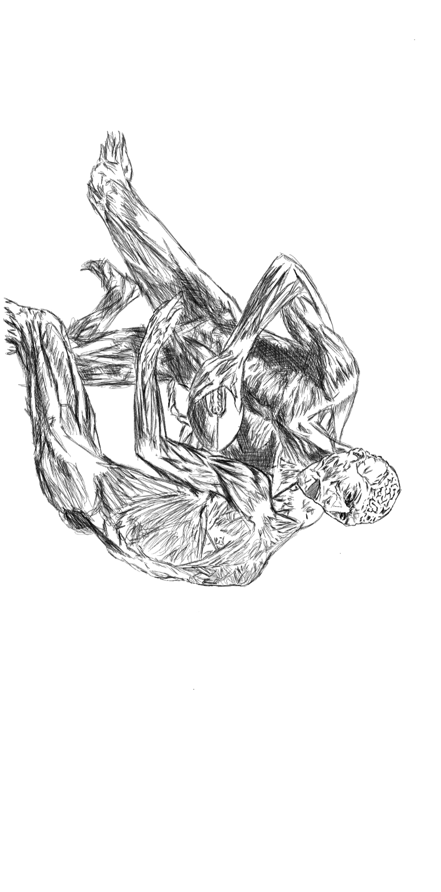

 

I realized that since I have the capacity now to become more stable in Cayman Islands... I should do more focused writing projects - like the book I'm thinking a lot and diving into topics that I quite need to understand more... like how our body functions with hormones (dopamine, cortisol, seratonin etc..) and how it affects our thinking and health in general. Climate adaptation can be another blog series. 

Still I'm learning how to learn faster & effective while sorting out my responsibilities for my family in the Philippines and for myself..

I'll start with the hormone [Serotonin](https://tech-stoic.github.io/serotonin/) next blog.