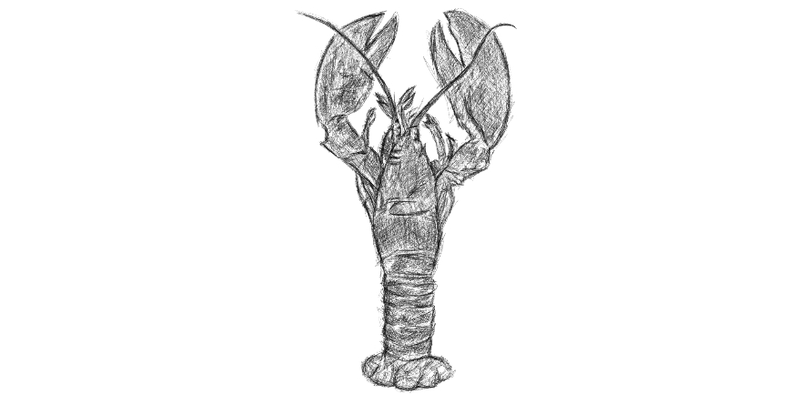
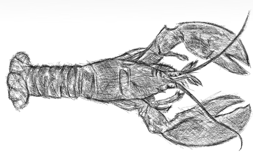

 

Before encountering a lot of lobster stories from Dr. Jordan Peterson's book "12 rules for life".. I have one of my most depressive periods in my life as it is often associated with low serotonin levels but the under-educated version of me knew this as the scenario that I went back to square one - zero money, my former business partner not communicating anymore with me leaving me out in the abyss - questioning my own decisions - the not so fun stuff.. 

But on a conceptual standpoint, I'm taking so much experience out of my way of processing decisions after that period as I try to navigate my actions, trying to apply my "zero regrets ethos" as much as possible. I believe still that the things that I've learned from being swindled by a person you entrusted your wealth & efforts led me to this state where I can understand even the worst possible situations - like the genocide of Jews done by the Nazis and the marxist ideologies that play with Gulag deaths. Human nature is the most complicated thing in the universe in my honest opinion.

 

Lobsters have lived for 250 million years and is a fine specimen for studying the serotonin & its effects with our body, as both species run the same frame of function. Rule #1 of Dr. Petereson's book says "stand up straight with your shoulders back" refers to us humans taking responsibility for ourselves so we won't be a burden to the people around us and develop the capacity to take on bigger problems through progression. The hormone serotonin helps us to do that like lobsters identifying itself around its enviroment under the sea & its interaction with other lobsters in the area - through offensive and defensive stances. 

Humans and lobsters developed a hiearchical structure due to the effects of serotonin. This fundamental hormone had allowed us to map ourselves in the sea of difficulties of our existence. We even navigate as to where we stand with our personal relationships &  even as far as our role in the universe. Our lack of this hormone seemingly puts us in a downward spiral of depression and anxiety. Unfortunately, as I've said many times in this blog that we are ill educated to brain science, most of us dying off without realizing the hormones at play inside our body.

There are so much things more to understand about how serotonin affects our health but I'm just zeroing in to the attribute of it that contributed to our evolution - from sea creatures like lobsters - ending up in trees as primates then humans exercising the right to consciousness trying to make sense of the present. Early humans have existed due to dominance heirarchy - the ability to utter sophisticated sounds for coordination, learn how to make weapons for hunting and become the only fire-wielding animal ever to set foot on earth. Now, modern humans compete against each other in closed boxes called offices until artificial intelligence will become ubiquoutous - machine versus humans. For now serotonin plays a big role as we continue to chart the course of our history. 

I should talk about [cortisol](https://tech-stoic.github.io/cortisol) in my next blog..