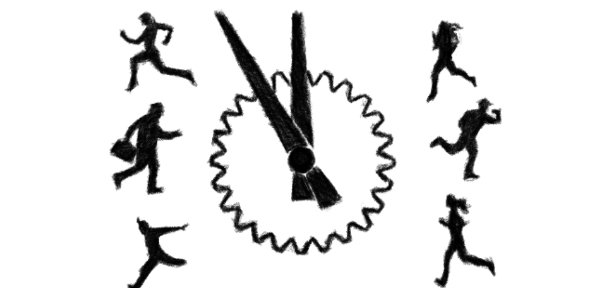

 

I wrote a [blog](https://tech-stoic.github.io/habits-shape-our-social-interactions) talking about modern society being so immersed with stress - virtually  at all times, most especially with the birth of habits that are built around technological advancements like the internet and even the old fashioned television. I have tried to evade this as my profession as an accountant is so exposed to this predicament. As it is virtually unavoidable to not handle critical issues and it's just impossible to not interact with what most people are tangled of. 

My personal medication to excessive cortisol release is predicated on maintaining a healthy mind, body & spirit. Building mindfulness practices through meditation, creating powerful habits ( eg.gratitude thinking, blogging, coding, music etc.) and focusing on a healthy lifestyle (exercising and ketogenic diet) are my defenses of choice. I believe it is necessary to invest in this kinds of concepts just to negate the negative effects of cortisol in our body.

It's just how the world works. We cannot evade it. I guess what our ancestors' advantage over us is they use the cortisol effects "physically" in wars, foraging, survival... us I guess we get so stressed just sitting down shuffling papers in our desks with no way of releasing the negative effects. I absolutely believe it affects our decisions for food intake - as capitalism gains on stress, make dumb decisions on relationships - anger & rage over forgivene ss or empathy and even as far as making babies - as most of the middle aged friends I know are having issues with this. 

I always say to myself that we are writing history now.. but this part I'm talking about in this post is the part that I don't like us holding the pen for. It is the truth. Our chase for a comfortable lifestyle becomes s fuel to blind and dumb out minds - with too much distractions due to the technological advancements we have amassed in our generation. I'm so sure our we will go down as the most anxious societies that were built all time..