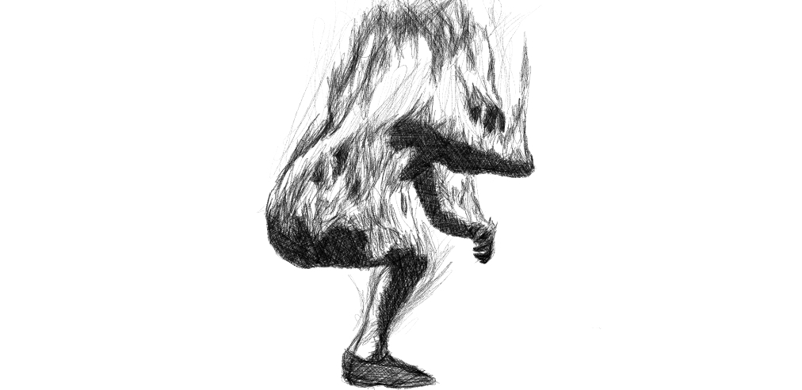

 

This is different blog and out of my current theme about hormones but I believe it is worth logging into this platform how I'm trying my best to adapt to what will happen in the near term climate changes.

I do expect that civilization might cease to become orderly in the next five years. On that end I try to make the best of the limited time to train for a robust physique and build the ability to use ketones for fuel. Scarcity of resources is the first thing in my mind - no food, no water & proper shelter for intense heat or strong storms. The downside to living in the tropics is if the ice melt of Greenland or Antartica will happen a lot faster due to positive feedback loops (like the methane gasses trapped in the Arctic permafrost..) rising seas is my no. 1 problem. I should learn the concepts of sailing/boating if need be... and swim properly...

I should also make a survival kit of some-sorts... I have been researching this for quite sometime. Great tools like knives, paracords, flints and water filtration systems should be essential. Fishing gears could be helpful here in Cayman. We are in the Atlantic Storm Path also and it will take time for help to get here if Category 5 or 6 storms ravages over the islands.

There is a lot to tackle and do. Realizing that most don't realize how things could get worse really fast.... It definitely multiplies the problems... It will be chaos.. most especially when it becomes tribal and / or primal as everyone will be fighting for survival..

Time is not on our side..  wasting resources is the most stupidest thing to do and the opportunity to go deeper into critical life preserving skills is my first priority.

