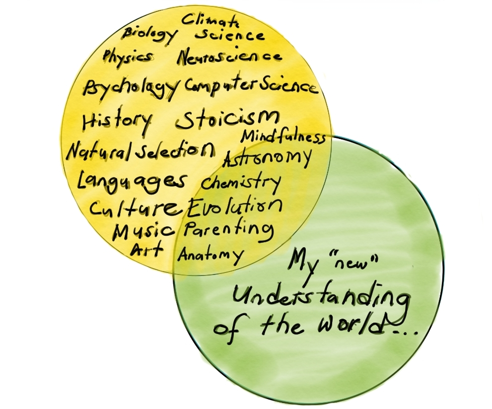

I took myself to different routes since January 2017 right after leaving Dubai which kicked off my partial South-East Asian backpacking trip for approximately 5 months and lived in Calibangbangan Island for a year and six months before learning javascript for eight months and now have four and a half months in Cayman Islands. Pretty much that sentence is an abreviation of a much more dense collection of experiences between having the extreme highs and lows of life (so far)... I have met the best and worst people and no regrets on those events, depression and stress came to picture and then after great passion for solving problems - even extreme difficult ones have propelled me and my most primed state as I'm more knowledgeable (I do not claim to know everything as even physicists would tell you that what we know in the universe composes only of [5%](https://tech-stoic.github.io/bloody-physics)), in grasp with fundamental truths (proven to be useful especially extreme cases..), healthy and has the capacity to experiment.

That first paragraph was so dense. The flashbacks of memories gazed parts of my occipital lobe as I write the letters or rather input codes to my blog engine through frameworks in gatsby, react and node. I sound too technical but that is a truthful description of what I am doing currently. It will feel cracky while reading this, especially those that have no idea what programming is but I'd rather say what I mean to say than hide it or rewriting the truth in a less direct and unnatural to my way of comunicating.

The important progresses from my leap of fate to counter the norm and educate myself in a highly unstructured but is an effective way. This doesn't mean that I'm highly reliant to the advantages of the modern world like the internet and online courses... but I have also invested enough time in living off the grid in Linapacan, no electricity and no modern water supply system involved for a year and six months.. The courage to experiment could have been my catalyst for this.. I have not taken any psychological tests or consultation as of late but what I could describe as being knowledgeable to the field is my innate strength of will to experiment is quite more than the average person.

Curiosity have given me a path away from insanity as writing and creating art became developmental  and the tool to sanity. The phrase "curiosity killed a cat" is a sure constant as most revolutionary, creative and inventors in history where killed by tyrannical powers, they gave us different views of reality - especially as most of them spoke the truth which kings and dictators hate. The hate of competence still exist today as some of my conversations become contentious or offensive whenever I touchfundamental concepts that are foundational to most people (eg. religion, professions, diet, health and exercise and much more). 

This is how I try to filter the world's chaotic nature - a number of disciplines / science (not only one) should be able to fit an idea and break it to sizeable bits of digestible puzzle pieces that eventually will reveal themselves if its going to be a good or bad one to consume moving forward. I call it new because it's just maybe a year in that I have doing this method of thinking. Again, I do not claim to know everything.. but I could say I know enough to understand what I do not know..

Like my blog [integral thinking](https://tech-stoic.github.io/integral-thinking/), I would need to keep on editing adding to this blog post... as the concept of teaching yourself is a never ending feat. As I ascend to newer landscapes like: migrating to Canada, becoming a parent or properly learning the guitar and music - these experiences will definitely push me to newer heights of curiosity and will continue to create positive feedback loops. Computer coding continues to baffle me and that is another big thing I'm trying to understand within my cognitive ability as I strive to contribute more to society.

For now.. life is good and there is no reason to stop creating art and blogs about how beautiful and remarkable living in the 20th century is.

PS. I wrote half of this blog in the newly opened Starbucks cafe in Camana Bay not because I genuinely want to try it...but I just wanted hide from the tropical rain. 