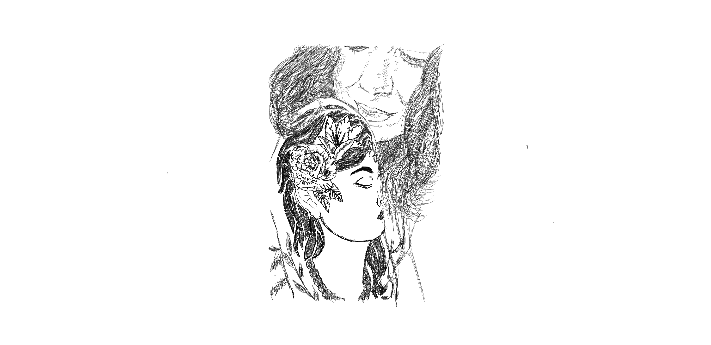

 

I really couldn't explain your influence in me for just two weeks. 

We've never met at all and yet your few voice messages have caused my fragile mind to play a bug that keeps me moving upward. 

I did made it out of the island. 

I'm alive and more equipped with knowledge and experience than ever. 

I owe it to you. 

You kept me dreaming of maybe one day I will finally see you in person.

I want to hear you speak chinese and german. 

I want to talk to you about taoism because I want to compare it to stoicism. 

I want to have coffee with you someday and talk to you about keto while I know your vegan. 

You gave me a glimpse of what possibilities can happen.. 

As I thrive here and learning at an exponential curve..

I'm so dumb at the time and I'm sorry.

I credit who I am now to you.

Weird to say but it is a definitive truth that I couldn't evade from..

That tiny bit of time that you shared with me.. 

I will carry and nurture, till I tell stories to my grand children.

I'm going to tell the story of how I met an eternal soul..breaming with happiness and art.. 

I hope you are well and safe..