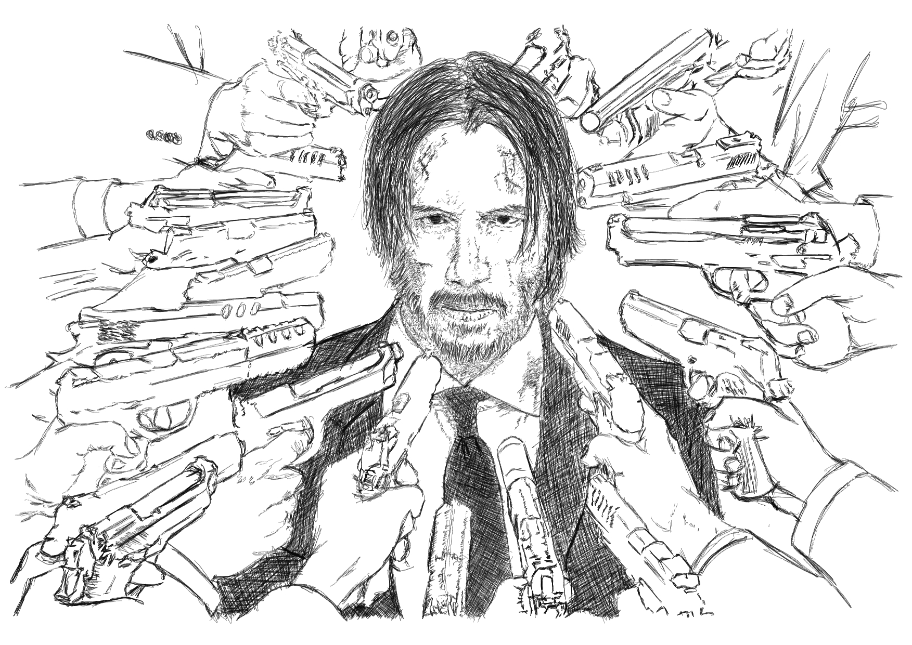

 

The world needs more truthful sources. Stories from people who have dealt with crap and tell the details of it - no matter what.

Like John Wick, no one should be afraid of telling the truth...or rather his truth. Why is that so, it is the way to know one's self... and is part of a better process of determining if your ideas are strong enough to hold structure in real world scenarios. 

The reality of it is based on my readings and personal experiences - the courage to speak the truth is a rare trait. So most of our society is rather choosing a safer, a counter-productive or a pathological way of navigating very complex problems. I see it a lot more especially in tight situations - choosing themselves instead of implementing what is better collectively. 

Life is hard, but lying makes it harder for people. Choosing not to exercise is a route to future sickness, easy for now but you pay later. The same with consuming sugar or alcohol. Concealing information will invariably code your brain to do the same thing again and again as it reinforces a bad habit - I have seen this time and time again to be fascinating and sad. 

I was thinking of a teenage dream kind of ambitious trip and have concluded that it was too impractical; I have altered my own little fantasy through the harsh reality that I am holding a third world country passport which hinders me from stepping going to the right places to execute the plan. 

I'm also thinking of writing a book the past month but after being offered to code remotely, I have been questioning that route for the past week. I am blessed with a gift to intertwine different skillsets plus an ability to understand more complex than the average person.....and the ability to code has been bugging me ...to a sense that instead of writing a book, why not devote myself to develop technologies that I know that can help other people? I did try that with Ethereum / Solidity / Blockchain but the thing is this stack of tech I believe needs more time - specifically decades more to be of impact to society....because of the impractical and massive need of electricity that the code needs to maintain the system and ill  positioned as we are to combat dire effects of climate change in the coming decade. I have seen some interesting technologies that I could substitute the book project. Neuralink is one company that I might aim to secure a slot in the future, as I  agree with Elon Musk on his personal drive to improve our cognitive cababilities to help or merge with AI in the future. IBM just open-sourced their code for cancer research of which I would like to look at - as I love freaking biology and how it makes me understand about our species. Space is another thing but I need superior understanding physics especially Einstein's theory of relativity. 

Knowing a truthful assessment of myself at the moment critically gives me the right options or arguments. It will really be a battle of arguments inside of me in the next coming weeks or so, hoping to extract the proper route.... I'm really grateful of the opportunities crashing into me lately; strong cognitive thinking, unlimited energy through keto and cycling -thus allowing me to better tackle bigger, more ambitious sets of problems.

Lastly, given the opportunity, health and clarity to do what compels me, I will do it...no matter the cost or walls needed to be smashed....Coming out of retirement to be a force of good.

