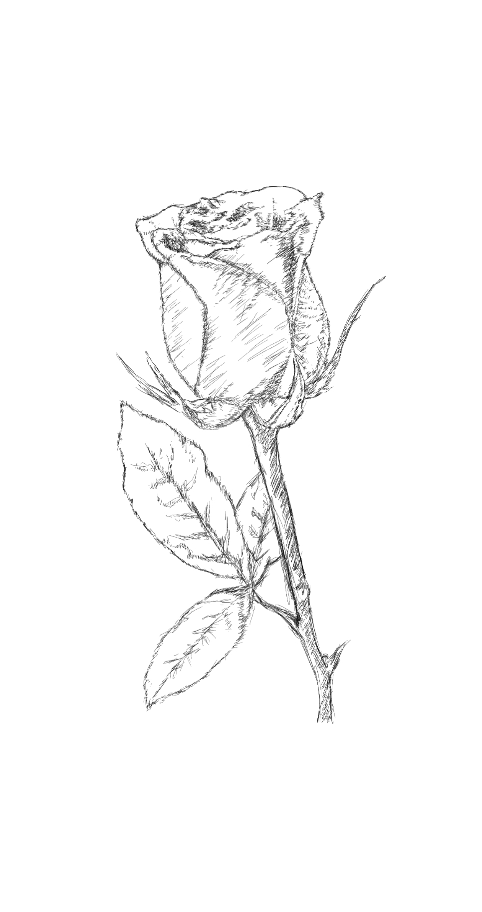

I have reflected a lot for quite a while on what I can say to you as of the moment, I hope you would hear me out.

I thought I would be okay if I were to die now, nextweek, tomorrow - anytime. I thought I was okay. Why? I had a great run! I did all the things I want whenever I want it while trying to stay truthful to myself and the people I interact with. I have traveled so much in my life, helped people in need. No regrets at all. 

I did the best life ever that I could, it was a good 33 years run. I bakpacked Thailand-Vietnam-Malaysia & Philippines and met the most amazing people. Most people from my country could'nt afford what I have done and for that I'm so grateful of the the opportunities that rain on me time and time again.

I have crashed and burn after Navotac. A drastic shift in my paradigm occured as I became more inclined into learning more about how our human mind works as I have tasted true maelovence in this chapter of my life and refocused my views on living as educated and truthful as possible.

I have been blessed along the way to learn from people (even from the interweb) and including words of advice from great philosphers through authors that invested to dissipate the truths of our existence. Deep diving the science of everything, from the atoms to the stars, the corals and the galaxies...I learned everything I could just to become better at articulating deep problems. I'm sure you'll find me to cracky most of the time. I surely love complexity.

I'm at my healthiest state: mind, body and spirit. Keeps on building foundational skills that bring me top shape. More grateful and respectful in most human interactions despite our frailities. I rarely get mad...after understanding that all of us make mistakes, and our subjected to biological weaknesses...it's just unfortunate that most do not know neuroscience, as it could be a game changer for our species.

I did a lot of mistakes along the way and have wronged people in the process, helped a corrupt family keep destroying a nation and lied quite a lot. I'm no saint, there are things that I have been involved and I will never be proud of those times..ever.

All the material cravings went away after I framed my thinking on stoic philosophy. I always try to control myself and not the difficulties of others -at the core. This is a lifelong pursuit and hope that you would understand my decisions in the future - grounded in this mindset.

Now I'm sure I would like to live... because I want to meet you. This I believe is the only remaining chase I'm striving for..to find you and build a future with you. If I were to die tomorrow, I would be fucking pissed of fate if we never got the chance.