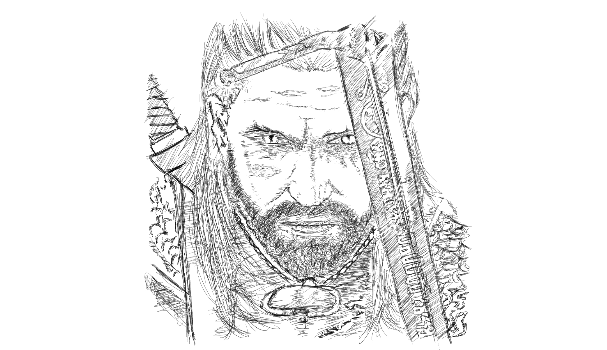
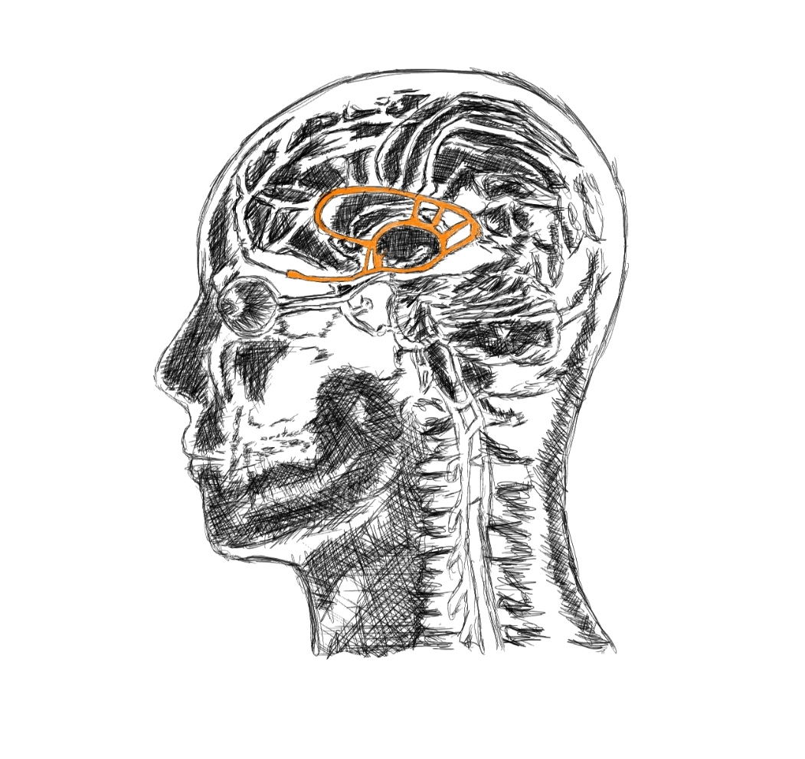
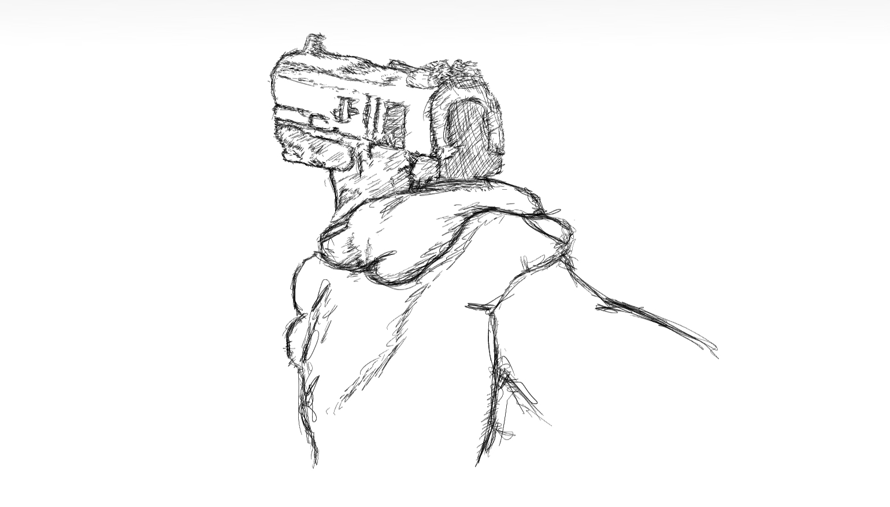

Geralt of Rivia! one of the best characters in a video game I have ever played, namely - [Wither 3: The Wild Hunt in PS4](https://en.wikipedia.org/wiki/The_Witcher_3:_Wild_Hunt). He embodies a hybrid genetic that turns into a monster whenever necessary to vanquish all the monsters of various kingdoms in his reach... of which I normally thought of everyday as a good characterization of what one of Dr. Jordan B. Peterson's most famous advices - The emobdiement of the monster. 

Let me expand on this topic as this will prove to be so useful to everyone - when you fully understand it as a necessary skill for navigating life..

The science now about our brain is formidable and well explained. The brain have three main parts, two of which I will expand more - the limbic system and the cerebral cortex. First, we have the lizard brain or the [limbic system](https://en.wikipedia.org/wiki/Limbic_system) where in we acquired after branching out from the reptilian cluster millions of years ago. Primordial in nature, it handles the coding of new neurons when we do exercises and autonomously run our our basic motor functions and the ability to react to fight or flight situations much faster than our [cerebral cortex](https://en.wikipedia.org/wiki/Cerebral_cortex) can process. This is why we have the ability to avoid accidents and react better during close calls (I have done this a lot while cycling in Cayman Islands and travelling parts of South East Asia) without us even comprehending what is happening. The cortices play a huge role in our learning, focus, perception, awareness, tought, memory and consciousness. Why I'm going complex on this? I'm sharing vital information that explain that our brain is composed of ancient mechanisms that we do not choose to make or rather we are born with the most complex thing in the entire universe. Most people without a good understanding of the science of how our mind works is most likely to fall short of their potential. Our brain is so ancient that inside it resides the ability to connect our emotions to what we do may it be good or bad. 

Yes! we are wired to do bad things too. I bet no one in this world who have not done anything bad to another life form - may it be animals, plants or other people. Most of the time we hurt the ones we so love. It is rather unfortunate and so depressing to admit that the people in the holocaust that shoot pregnant women at the back of their head are also of our species - they are also humans obviously.

That is the point of the skill - embodiement of the shadow. As we navigate the world, we are always exposed to myriads of complex problems normally associating people to be dull or fall short from tackling valuable situations. Accepting the reality to which we can destroy others and choosing not to - emphasizing control over our own intellect, while knowing we can trap ourselves to the detriment of our own and others. The control part is kind of tricky, also when trying to implement it while interacting with other people. 

Being as truthful as possible to oneself is at the core of the skill, letting self-assessment be brutal as possible. Critically knowing how our capacity to destroy should be a priority - physically and emotionally. That is why I try to maintain a high listening time through audiobooks and podcasts. This has been tremendously helpful as the ratio of time for my listening as to talking could be 9:1 or 9.5 to .5. This ratio is a vital source of clarity for me, enabling me to be more truthful to anyone I communicate and ground my arguments far better than the average person. Meditation is another invaluable way of establishing a better connection with myself spiritually. I try to disect pressing problems through my meditation and normally getting bold solutions to them and pinning my role in the what good or bad I may deliver during its resolve.  

To combat monsters, one must become a monster and control themselves. The inner monster inside ourselves should be the one that we battle first, as it's a more effective way of tackling larger challenges of life. This has proven to be one of my most treasured skills and I continually improve it in realworld settting. Moreover, it fits my [stoic paradigm](https://tech-stoic.github.io/stoic-philosophy/) - my operating system of choice.

I truly believe that no one can reach their fullest capabilities if they try to evade from combatting the shadow inside. Lastly, It is rather unfortunate that this was the case for most of historical accounts like the Soviet Gulag and Chinese Mao -where millions of deaths occured all over where people on top failed to recognize the most important battle - the battle within.