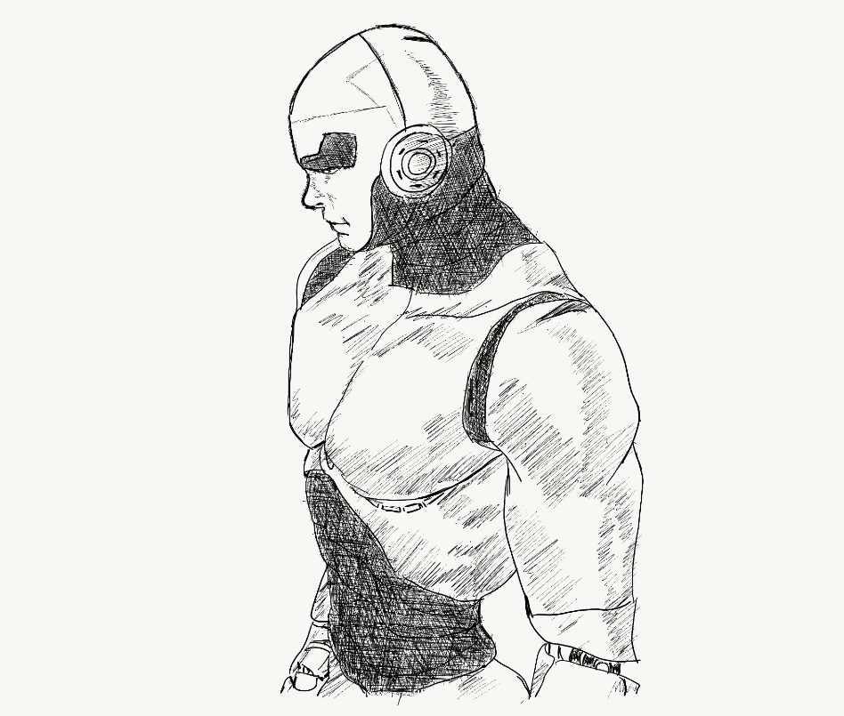

For the complete history of stoicism - I made a separate [website](https://migueldeguzman.github.io/stoicism/public/index.html) for it. But what I was able to do with stoicism is the main focus of this blog post.

Stoicism. I first encountered this frame of thinking from Tim Ferris, author of Tools for titans and 4HWWK and he explains it as his main operating system for life. It is a life altering mindset, much better than anything I've come across - believe me I've studied and tried everything. 

Ms. Alpha (my boss here in the islands) recently have a piece of comment on my look while walking towards her wearing my full packed bicycle gear all with a camera on my helmet. "Miguel is like a machine, he got everything right - he has his diet and his exercise". I hope I remembered everything that she said correctly but what my response to her is that "This island is like magic island, the island allows me to do practially everything I want". 

Why she called me a machine? I cycle a minimum of 14 kms a day, eating only meat and fats (keto!!) while trying to maintain a high octane kind of work in the ground floor of our company. I am just happy that she appreciated the way I try to do life - as I see most are just baffled or confused of what I do. She and her husband Mr. Elie (my boss as well) understands my views that is why I try to reciprocate the appreciation with the highest quality of work possible. I love their knowledge of philosohy and history and it makes it easier for us to talk most of the time. 

But that is not a complete answer as after reflecting much on what she said.  Why I do what I do is because predicated on the idea that I don't like regrets - health, learning and life is most real when your moving and experiencing.. stoicism is my pillar for this thougths. 

Stoicism fits with physics, natural selection, psychology, calming oneself and the drive to master skills. The ability to watch people interacting with you even in a contentious one - stoicism makes it easy to understand anything. It's just so weird that this way of thinking is so ancient as the greeks and it works all the time. 

When you were put into experiences where you lose everything - literally - friends, money and resources - this pushes one to make a complete reformation of life. I'm really happy that I have read on stoicism as it kept the last breathing piece of me to be intact enough to get things together and resurge with flames of freedom like a phoenix. 

Rebirth. I'm a changed person after I crashed and burned in my project in Palawan. But that gave me the most powerful realization of all - Invincibility is achieved in the mind, not through material things or the retinas of others...Invincibility is truly achieved in stoicism.

