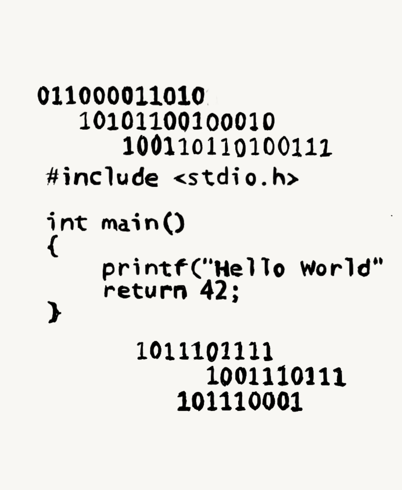

Zeroes and ones.. It's hard to believe that the modern world we live in now is built by this two binary digits..

One valuable use of code is making repeatitive tasks loop so you do not have to do them again and again. I am currently now tackling a project (I cannot say the fine details) for my boss that does that - outsource tasks to computers. It solves a few headaches for customers and the team and would give us more time to focus on the right problems to solve.

I want to emphasize in this post that this project is rather composed of less than a megabyte of data to complete with a fair bit amount of time to construct the logic and extensive testing plus coordination to proper departments. Small snippets of codes that I call "bots". Bots are all over our smartphones through notifications, handling our credit card information, chats to our best friends... it's just the gifts of tech where we are in a time where moore's law is being maximized more and more - even me an accountant have deep dived this unprecedented opportunity of our times to code solutions for some routinary computerized tasks and make art just like this blog.

What I'm contemplating always about bots is it's asynchronous capabilities - codes that run in the background that no one ever sees, hiding from the GUI (graphical user interface) of any device or platform you are using. This type of codes are doing stuff that do not reveal themselves to ordinary users. A good example for this is what have happened to last US elections where Russia paid alot of ads through facebook just to push Trump's campaign. How futile that another nation can invest in chaos codes that push wrongful information to affect the minds of hundreds of millions. Insidous at it may sound, bots are worth contemplating about but it's just so hard to defend ourselves from it. I did shutdown my social media platforms but still use amazon to buy stuff -consequently lending some of my vital information. Google is feeding itself all of our searches - it knows what we seek, love or hate... we are powering it to access to all our data. It gets creepy as to how these tech giants have power over all of our information - literally.

