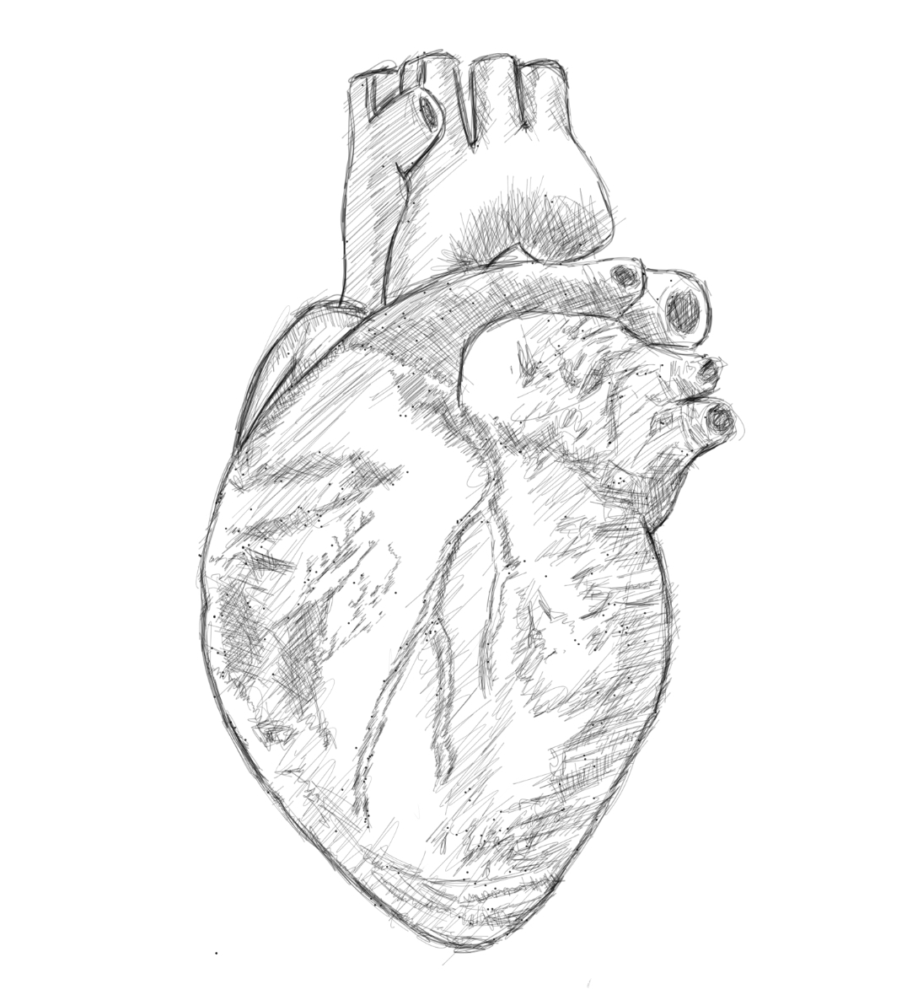
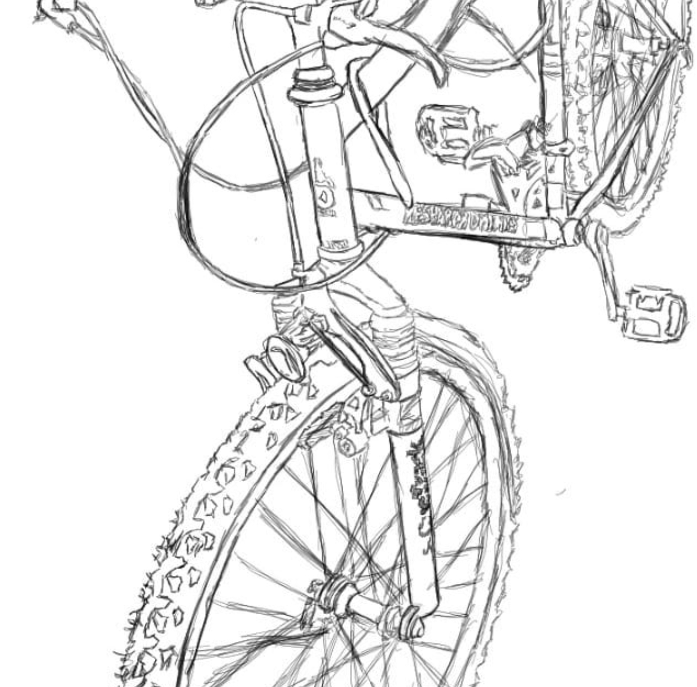

###<b>*Even though I have illustrated this, I still do not know what a healthy heart looks like..*</b>###

 

*But I did measured it a lot the past few days!!*

*My decision to cycle arround Cayman Islands, fourteen kilometers everyday non-stop fascinates me to the core. I recently checked my resting heartbeat per minute (RBPM) through Samsung Health app and my Smartphone and have found that it is flirting at 58 to 64 heartbeats per minute. An athlete's heartbeat is at 40 to 60. Mine is so close to an active person in sports! Bloody briliant!!!!*

This is Red. A bicycle that I bought from Ms. Lois for CI$ 75 last April. Costs I have incurred to fix, maintain and improve Red are as follows:
* 2 tires at CI$ 16.75 each
* 2 Pumps at approx CI$ 26~
* Waterproof Sits for CI$ 16~
* 2 inner tubes for CI$ 4.75 each
* WD-40 for approx. CI$ 20~
* Metal Basket for bringing stuff - CI$ 22~
* Tools approx. CI$ 30~

<b>Total Cost of my almost athlete heart: CI$ 232~</b>

 

How I achieved a great milestone for just merely spending so little? the discipline should be definitive and always at insane levels. The daily routine goes like this:
* Try to wake up 4AM to 4:30AM
* Meditate 15 mins to 1 hr; Try to do calisthenics after recovery / rest..
* Prep for 30 mins to work - the usual stuff
* Go cycling 5:30AM - 5:45AM..(7.2 Kms..)
* Work extremely well from 6:45AM to 4:45PM; try to squeeze a blog and art all after lunch..
* 5PM cycle back home (7.2 Kms..)
* Buy supplies and / or Prep food (keto) dinner and the ff day's lunch.. normally 6PM..and eventual dinner.. 
* Complete partial blog / art, code / study JavaScript and other topics of interest -normally through youtube and podcasts after dinner. Occasional Mobile Gaming..
* 8PM to 9PM sleeptime

As you can see from my abbreviated list of things that I do everyday - there is no downtime except for sleep. This schedule will drive an average person mad. Well it worked out for me that is why I would recommend this routine to everybody who's wanting to create a healthy lifestyle. The downside I guess that the courage to do hard physical activity was not distributed evenly in our species and as obesity is so common now.

Integrating a life long passion for at the very least an aerobic exercise will greatly enhance your life, relationships (sex life, transferring healthy genes) and career (better cognitive abilities). I hope anyone who gets to read this post should study what I have written here very carefully, as I would argue that this is one of my best articles ever written.  

