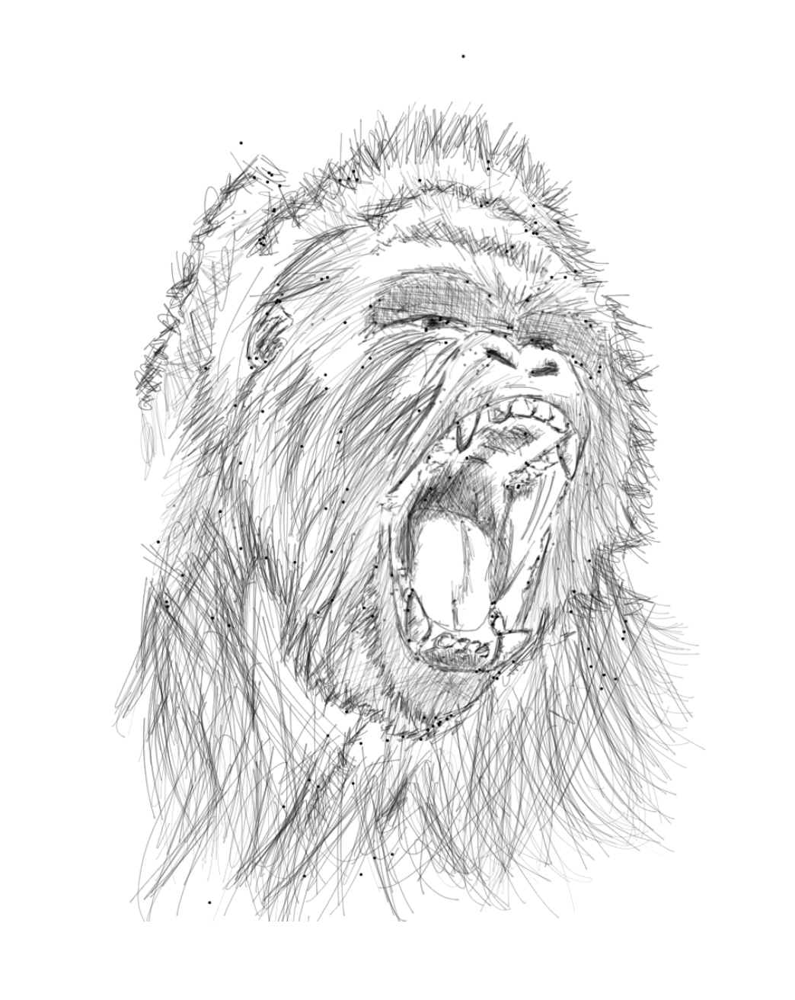
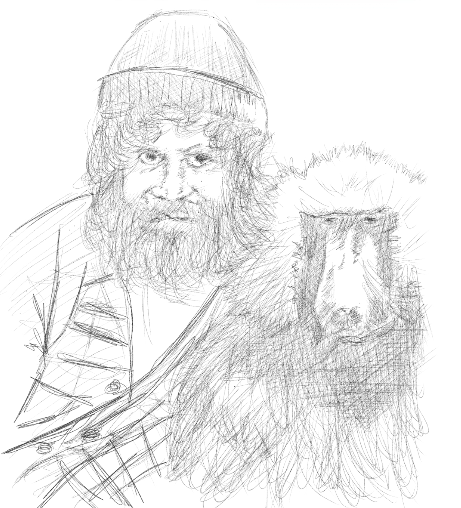

###<b>*Screaming Biology!*</b>###

 

*Been doing a lot of deep dive learning human behavior biology and personality traits instead of focusing on my advanced javascript course. It just is so fascinating to study the capabilities of our brain and how evolution worked for eons to create us and we clearly started from apes. The field of primatology paved way for a lot of scientists and researchers to study how pre-human nature works and gave us more deeper understanding of deep topics like infanticide, aggression, maternal instincts and sexual preferrences* 

*Dr. Robert Sapolsky's book "Behave" is so fundamental in my understanding of filtering what is good and bad as we are wired of so much neural networks where it is rather becoming difficult to say that we are all making decisions as a cause of free will.*

*He's one of the most fascinating persons I've come across with in the field of biology especially primatology. He's lecture on the topic is bloody on point as he explains how our so called human nature came to reality. I'm just on lecture 3 of 25 and I'm in awe of the depth of progress that we have accomplished in the field. I still need to turn them though to audiobooks so I can consume them while cycling and at work - when there will be downtime.
Here is the link to [the lecture series](https://www.youtube.com/playlist?list=PLpXaCv0b7h12LpVunZ361VfCBQSwi_2e8).*

*Training myself to understand more complex topics paved way to better conversations with all sorts of people and paved way to a much deeper gear of empathy as our genetic code is not perfect. Even though natural selection is inaccurate at most, it still paved way for our species to dominate over time.*