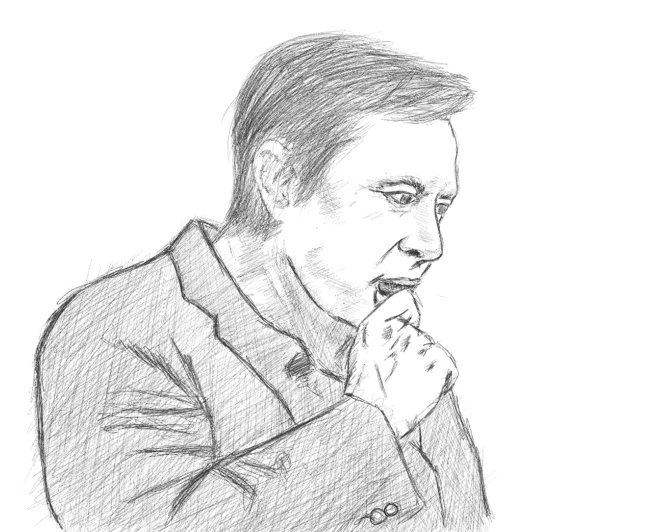

 

###<b>*TStarhopper successfully did 150 meters flight vertically and returned to the ground in 57 seconds today!*</b>###

 

Just a quick blog about [Elon Musk](https://en.wikipedia.org/wiki/Elon_Musk), using my lunch time to make draft blogs is in-operable as of late because of the need of me to concentrate on solving some problems at my work in Cayman Islands. 

Back to Elon... I've followed him for years now where he was working on [Tesla](https://tesla.com/) and [SpaceX](https://spacex.com/) after the infamous [PayPal Mafia](https://en.wikipedia.org/wiki/PayPal_Mafia) and always waiting for his September event yearly (often times exactly at my birthday) to see what cool stuff he have came up...that was before a lot of the newer [Neuralink](https://neuralink.com), [Boring Company](https://boringcompany.com/) and [Starlink](https://starlink.com/). I try to model his way of thinking a lot but yeah it is rather hard to mimic someone who I believe to have a genetic mutation. 

I wish to work for this guy in the future, the future where he is converging humanity to reach for the stars..

PS. Obviously I could write a lot more info about Elon - maybe in the future, yet I would keep this blog open to like savor the moment where humanity was blessed with the mind and heart of probably will end up as the most important person in history ever.
