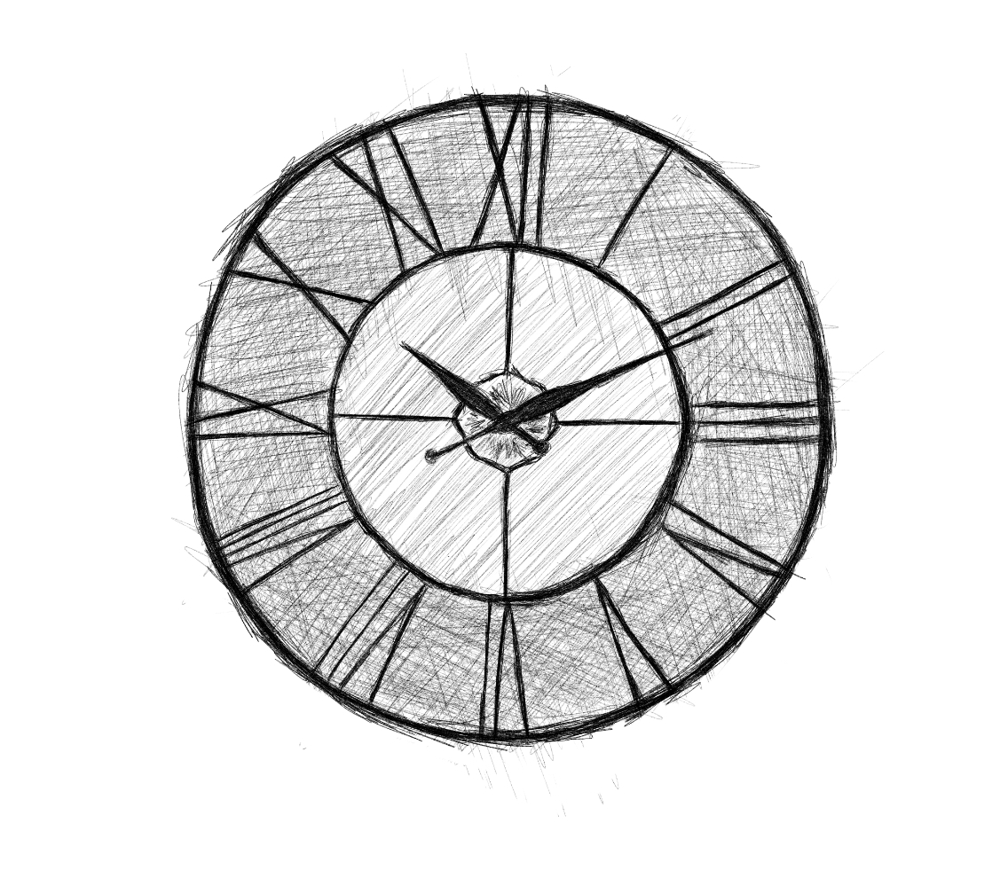

 

I will learn more physics and quantum theory!

Spend more time with my nanay!

Learn python and AI!

Meditate more!

Be good at speaking French and maybe German!

Increase my fluency in Spanish!

Visit Galapagos Islands!

Write a book!

Code a project I could be so proud of!

Learn how to play the guitar!

Spend more time with my future wife!

Learn ju-jitsu!

Create art every single day!

This wishes of mine cannot be bought or be exchanged with anything. 

Time is the most important resource - ever.

PS. I'm trying to do everything to achieve all of what I have just said above ^_^