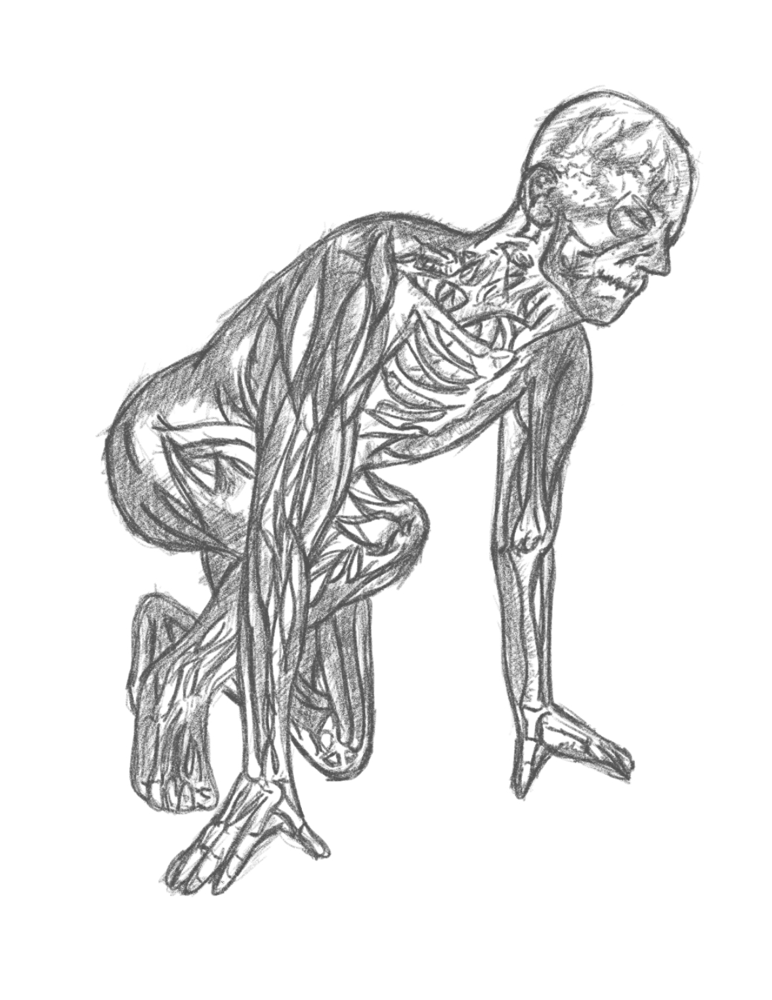

 

***How I might have wasted 33 years!?*** 

*After four lectures of [Human Behavior Biology by Dr. Robert Sapolsky and Stanford](), two lectures of [Personality Traits]() plus a lot of [Dr. Jordan B. Peterson]()'s works or talks* I'm reflecting in hindsight how my decision to take accounting as a profession faired if I have chosen my original plan to become a civil engineer. Assessing a biological take to this decision is leading me to believe that I made a big mistake.

*I'm a creative introvert. Well grounded on psychology - I'm very high on trait openness and dislikes big crowds and small talks. Having said that, my temperament could have faired way better if I took a profession that gives me the power to create - build better solutions, non-stop. Since World War 2, the world were framed to exist through the works of engineers - as most of the world's civilization now are found in organized cities. Business is done largely on running small tasks that are being documented and assessed by accountants and be reported in a timely and accurate manner. Maintaining systems vs. creating systems - that was the difference and if I took the path to STEM (science, tech, engineering and math) field. Being a creative accountant means I will end up in jail or become uniquely positioned for manegerial roles that overlaps to other departments. Being a creative engineer (depending on the field of expertise) will position me to create solutions or technologies non-stop.*

*I made the wrong decisions.. if I only knew what the literature says about creative people, I will choose engineering over accounting. But as a man of no regrets, I thrive on moving on after realizing my mistakes in a certain situation. Finally putting a nail in the coffin of this day where I changed my mind right before putting my course in my application papers - it is solitude at it's finest. Knowing the answer is enough.*

*I'm happy to have chosen web development for the past year and it have tremendously increased my aptitude in solving all sorts of problems. Coding is a step by step process - connects the dots, each connected dots that turns into lines push actions to basically all sorts of internet connected devices. Biology, primatology and neuroscience have taught me more than enough to understand and predict how might have life turn about. I might have made the wrong choice but the people and experiences that I have met along the way are invaluable - no way I would trade them, especially that I have still end up to creating art like this blog.^_^*
