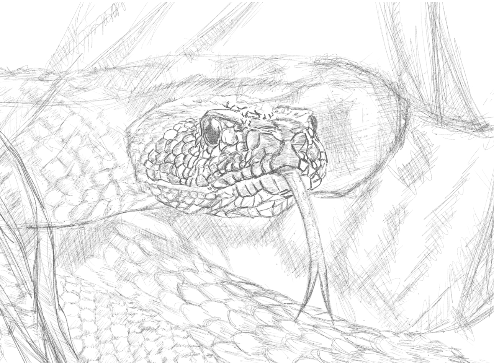

 

***120,000 years ago - we are apes that lives on trees and so as big serpents..*** 

*We have one of the most powerful eyesights in the animal kingdom. By far the only animals that are better than us are birds of prey like owls, eagles and hawks. But how we get to have a brain where half of it is dedicated for  image processing - one theory is how serpents have helped us to be hundreds of thousands of years ago.*

*The theory works like this.. the ape who was able to see the snake in the trees most likely have lived and become our ancestor. Also, another correlated myth where we got our ability to adore mythological and religous personas came from those who were able to slay early snakes, as the stories of these called "heroes" got repeated over time. This I think is one of the best topics I have crossed in the past months, also allowing me to become more grounded on how can natural selection workout across different species and allowing another to evolve for the better at very random instances.*

*One of Dr. Peterson's warning that I often reflect whenever I see people acting fuzzy or attitudes swaying like bamboo trees is to see that the worst snakes that anyone can encounter are the snakes personified inside people. This logic flows as well in Carl Jung's theory of embodying the monster inside us where I discussed extensively in another [blog](https://tech-stoic.github.io/embodiement-of-the-shadow/). There is good and bad in our biology, one cannot evade such and must accept to be able to navigate life better. Another short blog but I'm very happy with the art that I have created for this post.*

*P.S. About the art - it felt really really weird while I'm doing the head part of the snake... this might have been our hard coded or innate optical recognition to clearly be petrified with just looking at snakes..*