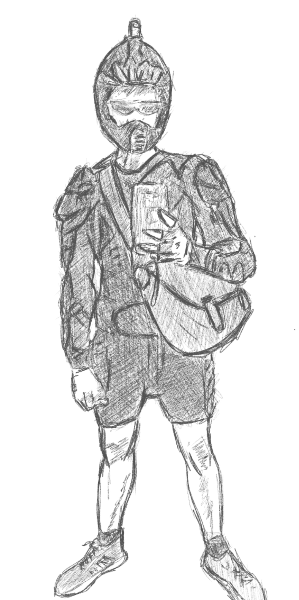

 

***Everything should be black and sweat proof..*** 

Well nothing in Cayman is sweat proof, always tropical weather all over yet I like to reduce my daily decisions so minimalism is a prioroty at the core of my thinking. Most of my gear is colored black - makes it much simpler to think of what to wear, reducing the need to make decisions on what to wear.

I had challenged myself to a minimalistic lifestyle since I did my backpacking trip in Thailand, Vietnam and Malaysia for three months and up to my stay in Palawan for more than a year. Less is more, less things to own means more room to think plus more money saved over the long run. Buy only when necessary and always go for quality. Simple habits gives us more control over our time and  allows us to spend it on what really matters. 

Another shortblog but I bet is very important. Again, less is so much more..