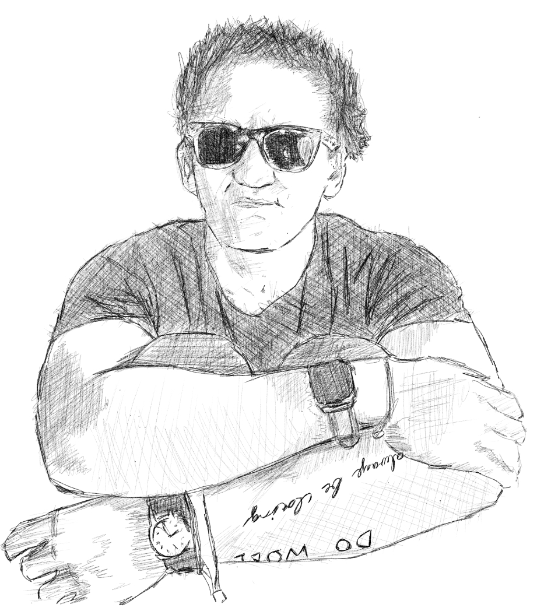

 

 

***I just started watching his videos back in October 2016 and the rest is history...*** 

Casey Neistat...

There is no amount of words to thank this guy, he practically ripped whatever I had known as for the past 31 years. Him being a single dad at age 17 and striving to become one of YouTube's elite filmmakers is a [story](https://youtu.be/V6Y-ahQFQDA) worth remembering time and time again. His message and short stories uploaded in YouTube become a new wave of framing that piled around my brain until I realize that the way he handled his curiosity for filmmaking can be modeled. In tried to structure my way of life to his, but unfortunately my custom built life swayed into different twists and turns and here we are now to 2019... But he did inspired millions to do the same, that including me. 

There is no straightline path to life, Casey is a great example of this kind of story....smashing all of his problems through his renegade and unorthodox way of dealing with problems. This I believe is what I'm encountering now, even though I fixed some major holes in my life...I tend to see more holes popping up. But that is life in general and I'm glad to understand it more now and at a point where I'm still young and capable of reinventing my habits and thinking...

I owe this guy everything and my potential to create a bigger impact in the future. If I hadn't crossed paths with one of his videos.....I could still be a social media zombie today like the average person. I wonder if I could check him out in California next year...hmmmmmm?
