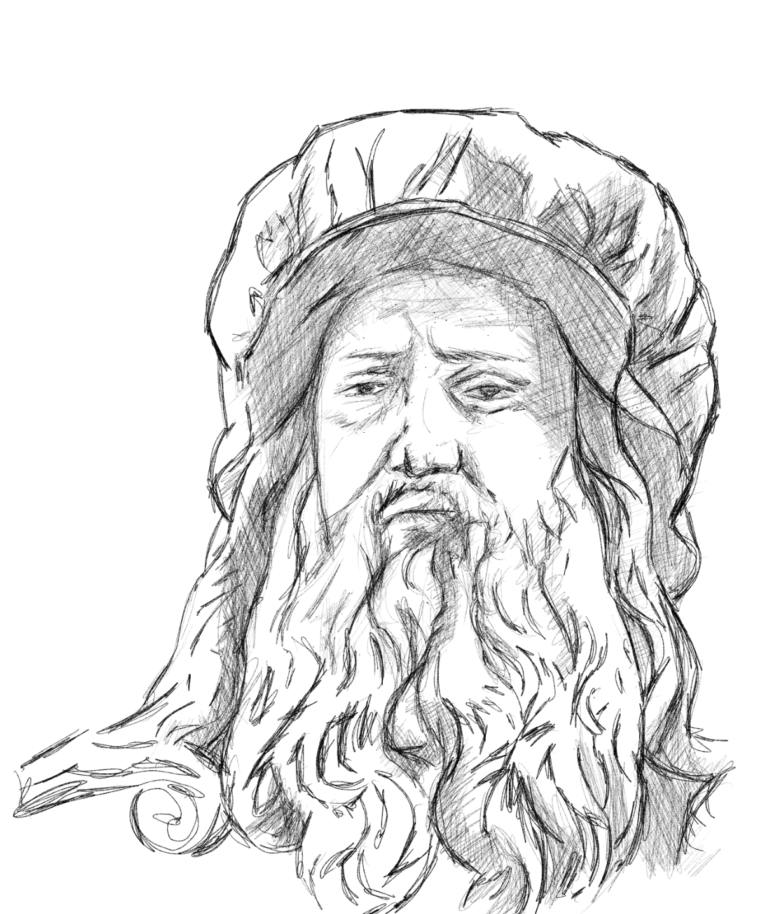

 

***He predicted how heart valves works hundreds of years before it was discovered in the 1900s!!!!*** 

 

Leonardo Da Vinci chased his curiosity to the ends of the universe. He painted, disected carcassed, made various inventions and documented each. If there are people from history that I would love to meet, He is on top of that list. I could maybe ask how he could have did it, without much tech, writing each and every line of his experiments... how he managed to navigate the time where people who question the norm end up to have their necks splitted from their bodies. I know that he was so sought after in the 1400s - 1500s but his views are rather hard to comprehend at the time. Him being poor has never been an issue, I bet he can talk his way out of many issues that he had with strong families and kings in Italy.

Curiosity have killed so many people in history and yet he have taken his to the heights where our a few of us in the 20th century can appreciate his works. I try to emulate his way of life, he merged science, art and philoosphy. I hope the power of the internet will give more edge to most of us as we clearly have the advantage compared to most of the likes of him who relied mostly on their brain. 

Or is it our disadvantage in the 20th century, maybe the abundance of the rewards of technology is hindering us from becoming more articulate of our own potential. Self-awareness is becoming more rarer as the average person tends to choose browsing another person's social media than exercising. Have we become weaker? there are tons of evidence to this in my opinion.

My journey to learning how small lines interact to create a narrative of cohesion where a nose or eye could emerge and create a face or an animal has been short yet life altering. Small things really do matter. Even tiny bits of curiosity....  

PS. I see that the self-satisfaction that I get for making this blog and the effort I exert to try make one single art every day have coded a habit in me to be more detailed to what is going on around me. I became a really articulate and analytic. It has saved my neck numerous times in my new work in Cayman Islands. I bet anyone can do this but unfortunately courage is not distributed evenly in our species...