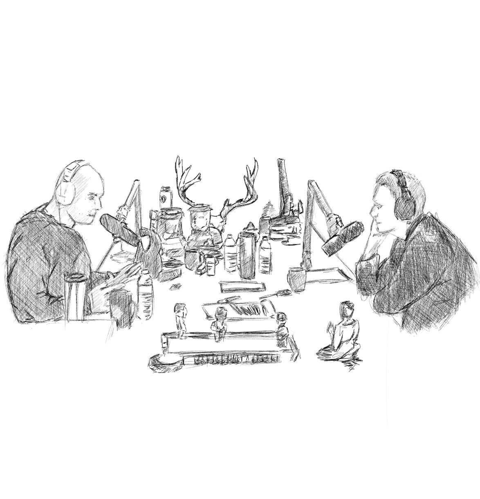

***This is the future of media..*** 

 

This is a memory encapsulating one of the most fascinating discussions I've ever heard, namely the [Joe Rogan Podcast #958](https://www.youtube.com/watch?v=USg3NR76XpQ&t=308s). Joe Rogand and Dr. Jordan B. Peterson talking so much about how to perceive certain things that we encounter everyday of our lives. I often re-listen to this discussion whenever I can, often realizing new concepts and how fascinating Dr. Peterson's research has been, trying to make sense of the world. 

This podcast got me to a lot of listening to tons and tons of different perspective about what is true. The cost of sharing information through the use of cheap high technology cameras & michrophones plus high bandwith capacity of the internet has paved the new estimation that podcasting will be the future of media and will replace traditional news broadcasting.

I'll also make this blog post a collection of my most coveted talks I've come across in the interweb. Highly recommended for people that have high degrees of openness to experience or those who need clear paths, away from depression and negative emotions

* [JRExperience #958: Dr. Jordan Peterson](https://www.youtube.com/watch?v=USg3NR76XpQ&t=308s)
* [JRExperience #1169: Elon Musk](https://www.youtube.com/watch?v=ycPr5-27vSI&t=376s) 
* [JRExperience #1159: Neil deGrasse Tyson](https://www.youtube.com/watch?v=vGc4mg5pul4)
* [Jocko Podcast #98: Dr. Jordan Peterson](https://www.youtube.com/watch?v=23dArPpXgCM)
* [Jocko Podcast #112](https://www.youtube.com/watch?v=WHZjcfgk4CI)

PS. There are may be a hundred of different podcasts / talks that I have consumed over the past year but unfortunately cannot remember them all as of the moment but I will surely use update this blog everytime each of them pops-up again....