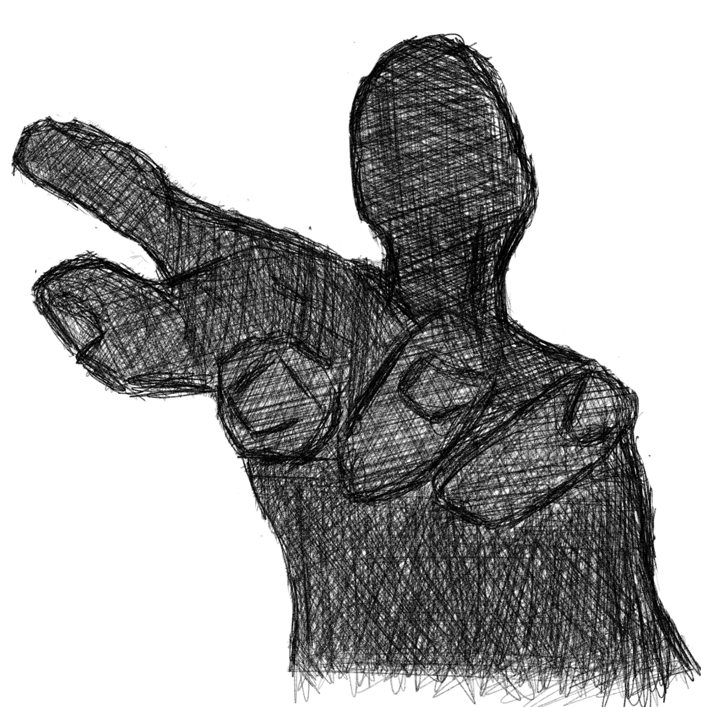

 

***I have been integrating projects in to my schedule that will greatly affect my personal time invested in this blog..*** 

But that is okay. At this stage of my life, I'm trying to invest my precious time to do what really matters. One of it is doing a lot to save the planet. It is not like I'll become Batman or something but I will be needing a lot of time to invest on projects that will help create a movement towards people being more knowledgeable about what our current landscape as of the moment as far as the climate is concerned and increase the likelihood of people becoming more responsible about their own actions. 

To tackle this massive problem I recently applied and got hired as a volunteer for [Cayman Eco](https://caymaneco.org/) of which helps spread the news on what is happening all around Cayman Islands and the world as far as climate change is concerned. Another project that I'm applying to be enlisted is [thinkspot.com](https://thinkspot.com/) where they are trying to infuse a lot of uncensored conversation in their platform, this is where more people will discuss a lot more without fear of getting banned which is a kind of thing that I believe is needed now because we are tackling really really big challenges like the threats of war, ai and as mentioned before climate change. 

The world needs more people that are trying to do more and that is what I'm signing up for. We can start from small things - micro things that could even be personal problems that we have with our existence. Making ourself less problematic will enable us to have more room to invest in more moderate problems and eventually bigger or even ambitious ones. Improving 1% a week is 52% in a year, let's think about that - this concept is so powerful as no one cannot evade the fact that a little effort compounded over time will eventually add up changing a dynamic of which it was applied. Small things matter, this is true in art, physics, biology, philosophy, etc etc.

Redundancy is a concept I'm trying to apply for myself - when everything I do fits like interlocking puzzles, reinforcing each piece. My gratitude thinking strengthens my drive to help my family back home and the pursuit of solid projects for the environment. Health focused routines like meditation, calisthenics, back stretching, cycling and keto helps me tackle more cognitive intensive tasks like stoicism, web development and working as an accountant. 

I might digress on my musical pursuits..still not settled on this though...