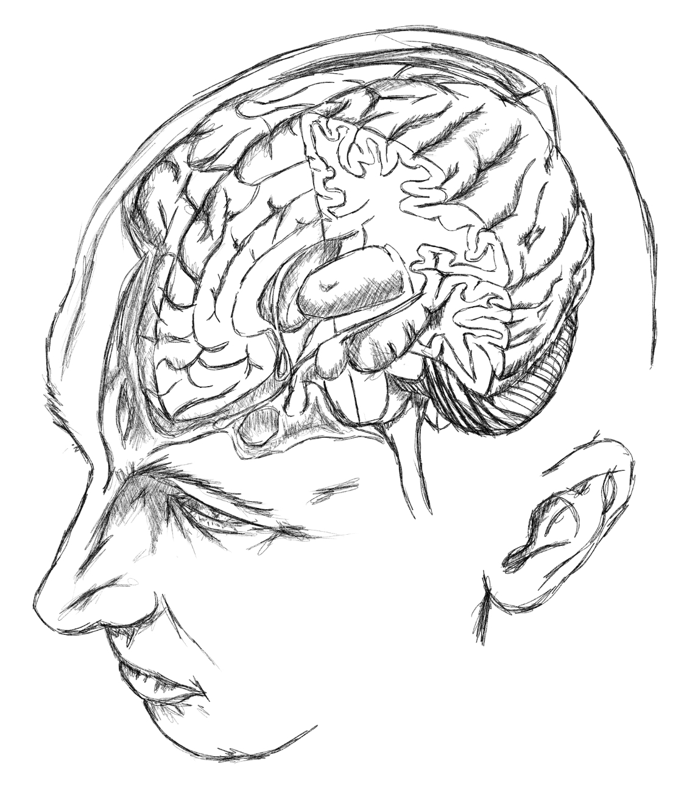

 

***Natural selection enabled us to have the most complicated thing known to the universe called the brain.***

Even though we have a powerful mind - the greatest tool at our disposal, we are still vulnerable to suffering. This is the fraility of having a conscioussness that ever discerns of the unkonwn, making us determine the good and bad in every situation even though reality itself is neither good and bad. We are capable of feeling disgust, pain or confusion - and not any other kind of animal is capable of making a complex sound called language of such. We are uniquely empowered and burdened.

Our powerful technology infrastructure and communication matrix allows us to do a lot but yet the biological part of us and nature makes us vulnerable. This is why even though I technically could buy a car, I still choose a bicycle to feel the outside world in its entirety and have a healthy cardio vascular system. This is why I study philosphy, psychology, history and neuroscience as these makes me understand the world more clearly - we are not gods and the average person acting like a god is on the disadvantage. 

Most modern men lack the knowledge of the past. That is why they think the world is young. That is why they think the abundance that the modern world have exposed us is the only life that our body existed. That is why most people refer life as peaceful forever even though 99.99% of history tells otherwise. 

We are built out of tremendous chains of genetic coding as a result of creating life and naturally selected death over billions of years. We started from single celled organism to fish to rat to ape to genus homo to modern man - this chain remained unbroken over ages. I wish anyone who reads this post will reflect on the profoundity of uncertain events that occured in the past, do not be dumb and be deluded with modern technologies. Think about it, our world is old and we are young, very young compared to how it has changed and evolved over time. 

Let us be responsible to the genetic code that has been given to us by unimaginable amounts of chemical reactions as such provided the breath we have. You will pass this to your children and your grand children, Do not be mesmerized with your social media account you created will be liked by the generations that will follow you, better focus on the heart and mind that you can healthily maintain and fill the body and mind with good habits instead of the stupid that translate to better genes..