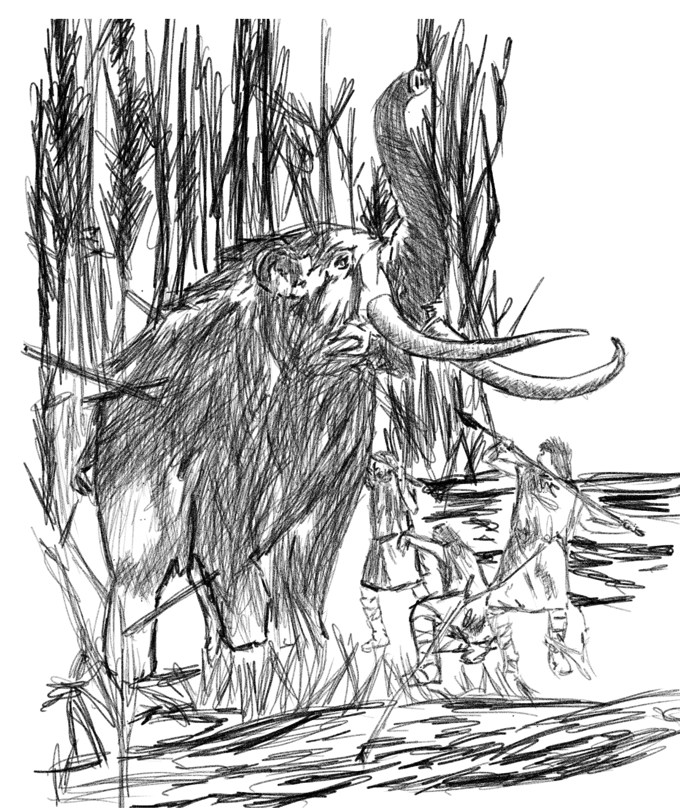

 

***Our ancient code never fully materializes by itself, it requires discipline and a sophisticated way of understanding to which a well crafted structure of history and biology..***

We are a product of billions of billions of experiments, something has to die for us to live over immense amounts of time. Even our recent documented history of wars and plagues crippled anchored pillars of time to which the ones that survived eventually became our ancestors. We used to be hunter gatherers, our bodies built with the capacity to run for longer periods of time including an upper body structure that can throw with precision. Our dexterity to make basic tools and clothing brought us an advantage over most animals - where in we are able to adapt in a lot of different environments. (This is the reason that we can live in deserts, mountains, jungles and sub-zero temparatures. 

I am just fascinated of how the current world setting have made this scientific based understanding of our early stages so hard to understand. Probably it is because people tend to think easily due to the comforts of the modern ages have been constant for the 200,000 years that genus homo branched out from our most closest primate cousin. This definitely is not the case. Hitler just killed millions of people and the average person tend to think that it was a long time ago...no it's not at the grand scale of the story of life.

The world needs better education especially in history, biology and psychology. I have recent news of some silicon valley companies that approach this grand scale of feat as the race to upgrade our way of teaching future generations is increasingly becoming so important. I might create dedicated notes on these platforms especially [Singularity University](https://su.org/), [Mindvalley](https://www.mindvalley.com/), and [thinkspot.js](https://www.ts.today). There are really great push to move humanity forward and supporting them is my current pursuit. Donating to Dr. Jordan B. Peterson's [cause]() every quarter is what I though to be allowed of my current financial capacity. He's pursuit to create better individuals through accepting responsibility for their own lives is something I am on page and betting on.

Doing nothing makes you dumber and doing too much makes you a liability, but I think one cool ability of us humans that we can understand and project the future so we can make better habits should is something everyone should think critically with. Built in us are biological capacities that should be taken care of and nurtured daily, brains should be fortified with great ideas. We are what we eat and consume digitally - be careful of what ideas and health habits you reinforce over your lifetime. Do not forget that we have ancient genetic body that needs nourishing all the time.