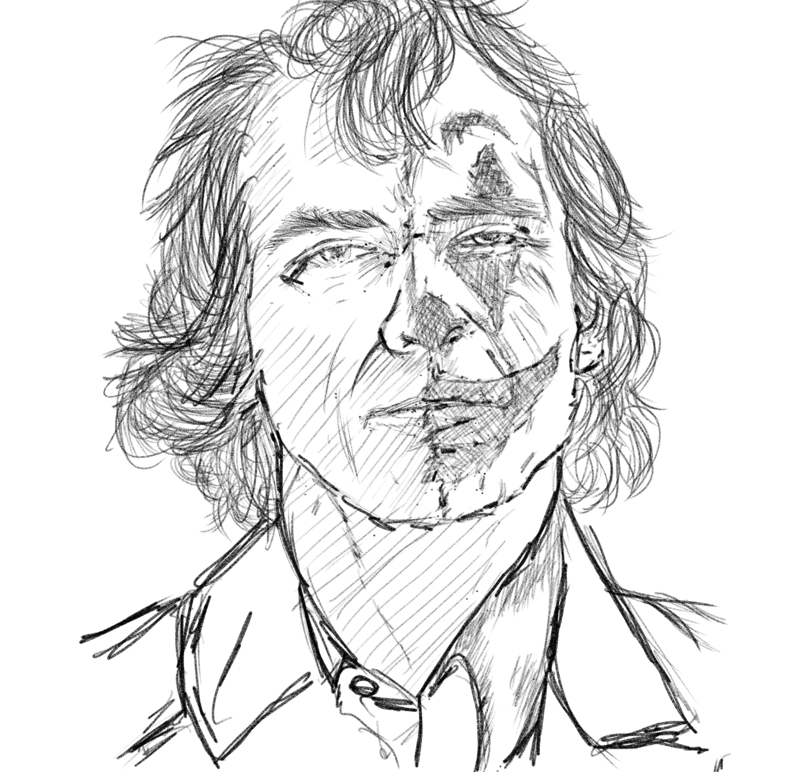

 

***Just finished watching the joker and its bloody moving to reflect on how society can create a maniac like him..***

Seemingly insignificant projects becomes big when clustered together. In hindsight, it's great to lookback at these little experiments I made over the span of four years as I am reassessing my plans for the coming years - it would be valuable to have like an inventory of such..
* Investing in Navotac - the lowest point of my life, fascinating road of meeting the best and the worst of people the world has to offer. 
* 1st [YouTube Channel](https://www.youtube.com/watch?v=3ZpsI-XOuzo) - travel videos in my trip in Thailand, Vietnam and Malaysia. Had some videos of Navotac there too..
* 2nd [YouTube Channel](https://www.youtube.com/channel/UCSvsJZz6MztOXu_UE9tk7lw) - this I should build more while I'm on the island.  
* tech-stoic.github.io (aka this blog..) - art and blog of concepts that either 1) that significantly changed my view of the world or 2) ideas I'm tinkering /learning...  
* Old blog about [blockchain](https://http://blockchainarchive.wordpress.com) and life.
* a personal [website](https://migueldeguzman.github.io) 
* Red (my bicycle in Cayman Islands) and Cycling my way to achieve an athletic resting [heartbeat](https://tech-stoic.github.io/)..
* my web dev [projects](https://migueldeguzman.github.io/projects.html)
* the drone that I broke (Coldy is dead I think lol need to check his batteries every now and then..)
* a podcast on stitcher (need to revisit this..)
* an iventory monitorting for 12 construction projects using excel / pivot. I trained non-accountants to do excel which is one of my best highlights for my career as an accountant (yes! I am an accountant haha of which I rarely talk in this blog..)]
* an ODBC plugin to quickbooks (an accounting software) that creates a link to excel of which enabled us in Dubai and enabled us to create customized invoices (including arabic translations..) quotes, invoices, purchase orders etc etc.
* Switching coding practices from windows to mac OS is a project all in itself...
* Keto - one of the core fundamentals to my surge of productivity... got to balance it with building strenth...
* Calisthenics for building strength and a bit of mas..

I'm thinking also of using the [astronucleus](https://astronucleus.github.io/) domain for an online book..