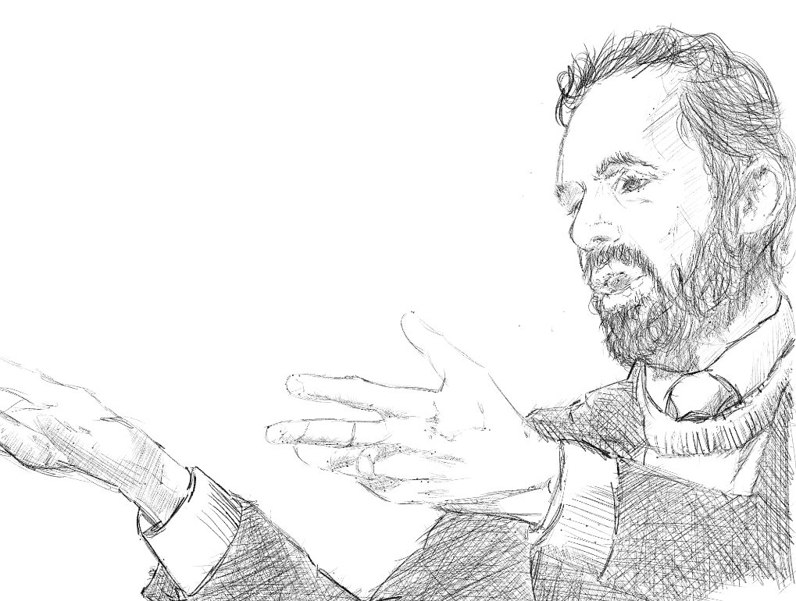

 

***Help the world if you have the capacity to do so.. A thought that ran into my brain while after [Dr. Peterson](https://www.jordanbpeterson.com) explained how one should tackle individual responsibility first before spreading it to the world..***

This blog is one of the steps I'm taking to understand the stages of my adult life. I'm taking a lot of action to try to develop my skills in a lot of areas I'm interested with while applying them for the betterment of society has always been at the back of my head, constantly contemplating whenever I can... 

Volunteering is a milestone I'm reaching out deep in to my cognitive and physical capacity. Now I'm helping Ms. Tammy to remodel the [Caymaneco.org](https://caymaneco.org/) website. I'm looking to spend my vacation in 2020 to volunteer in a different country, I applied for one today for a wildlife sanctuary in South Africa which specializes in handling lions, hyenas and leopards. The guy behind this project is [Kevin Richardson](http://www.lionwhisperer.co.za/contact/), also known as "The Lion Whisperer" and I did cited his case in [one of my all-time-favorite blogs that I wrote](https://tech-stoic.github.io/7.7-billion-gods/).

There is this feeling that I am trying to do so much stuff. I do not know the path for this stage moving forward but I guess realizing that there is more things needed to be done is a critical step of which I'm willing to take now more than ever. The unlocking mechanism to my potential as an individual connected to the cosmos is best extracted through accepting the responsibility in all areas of life within my grasp. This stage is bloody challenging for me. Being financially stable is a downside to my ability to focus on what to do next - making me consider more options which is most of the time not good.

After I settle all of my debt (yes I'm paying for the Navotac project still..) - I'm going to see if I can finance some coding projects with remote coders in the Philippines. We'll see, there is really so much options.