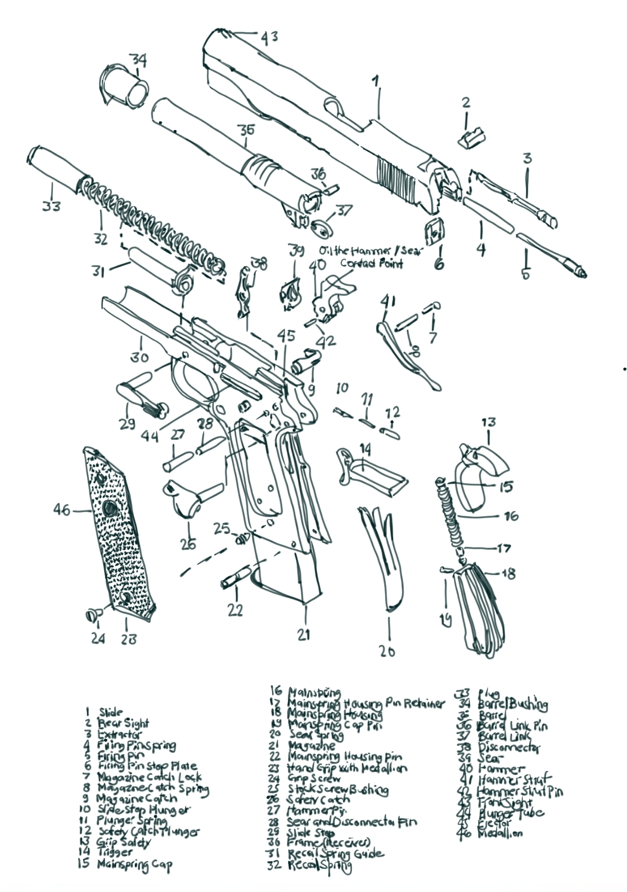

 

***This 1911 9mm pistol is the most used handgun of all time in American history...***

A quick blog! After receiving my invitation to the cissa.ky gun membership club, I've been readying myself for the intro seminar. Watching a lot of tutorials and using this  blog as a way to remember the gun parts I needed to focus on especially the degree of discipline needed to carry oneself through the journey of mastering the craft is extremely high, I have never encountered a skill mastery so strict as recreational shooting. 

Mr. Joey's stories really reinforces the idea that mastery of the craft of shooting is freaking hard - as it takes a certain understanding of physics because of gun recoil and the bigological factor that one should practice enough to gain tremendous muscle memory to control the gun everytime a shot has been taken. I see Mr. Joey's arm shaking after an hour of session as all the stress and adrenaline rush flow through him as he try to manuever himself in the times I saw him compete locally in the range, he is actually one of the best shooters in the club which is inspiring as well.

As to my lifelong commitment to the opportunity to learn skills, the invitation should be met with enough preparation, knowledge and unmatched self-responsibility and discipline. I'm ever ready for this kinds of challenges as this is why we live for, the sacrifices to making life meaningful!
