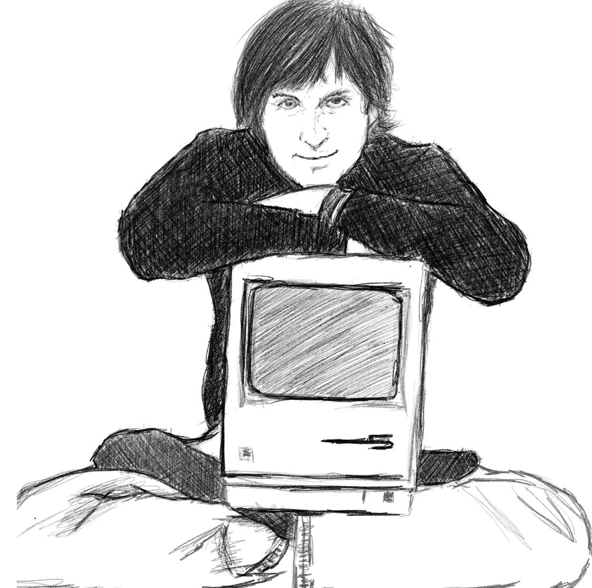

 

***Multidisciplinary, extreme design thinking and laser focus on details - Steve Jobs paved ways for how we will use technology to shape the future..***

A big part of my life is my fascination with Steve Jobs's ideas and masterpieces. Most of my professional practice as an accountant somehow revolved on curiousity which is very much against the typical office working type mindset which you should just do what you are told with less time to accomplish. 

He imagined that tech should be interpreted to the normal person, much easier than remembering software concepts. The hardpart of software development I guess is it was created by people where they hardly haven't made things in very structured ways, unlike other disciplines of development like engineering and architecture where there were a lot of history and experiments including legislation that progressed ever since the western world began. Sofware development is against this as most of it's development is built through rapid experimentation, fueled by overflowing capital and legislation unable to learn fast enough to cover for the downside of tech. 

The story where Bill Gates stole the "GUI" or graphical user interfaces where Steve have developed for the soon to release Mac is the incident that built the abstract foundation of better tools for us and modern day software developers use. Steve imagined the future like no other at the time. That is why this saying where I've heard from a talk of Dr. Jordan B. Peterson about creativity that (I'm going to paraphrase based on what I can remember) "There is such a unique thing about what art can do as the artist enables the audience to see the world differently which is comparable to what scientists does..". Steve perceived information much differently than the average person, able to connect dots that are rare, so rare that he poked a hole towards new tools that creators, developers and artists can use.

I just hoped he have lived a bit longer, It is so much of a waste to lose a rare intuitive thinker like Steve Jobs is. He is one of the few people that makes me think a lot of what I'm doing - especially what I feed my stomach and what I consume as content - technically what I feed my brain. Everytime I try to think about buying a car, I tend to pause and reflect that I could'nt let go of Red (my bicycle..) as the car would now stop me from exercising which in effect would make me lazier...that can snowball to accomplishments to my side projects. 

Steve Jobs, another person that I'm very grateful for. I am really happy of the technologies that he help enabled us to enjoy and use.

PS. Finally, I bought an actual Apple product just this August. I'm a full pledged apple fan now ^_^