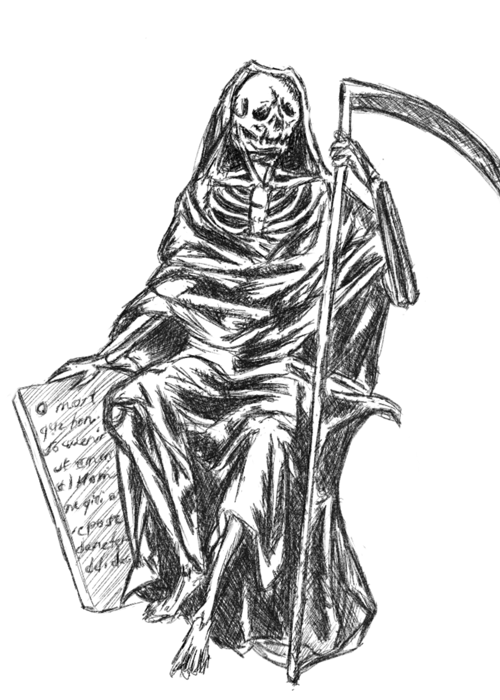

 

***Remember that you must die..***

Stoic philosophy took me to roads I never thought I would cross, concepts so that never gravitate to 99% of people who live in the present. Death is something I revisit everyday after that boatride in the middle of the storm almost two years ago in Palawan. I often think that what I do as of the moment could always WELL be my last. That is why I lost almost all of my fear - uncomfortable conversations, people, losing someone, snakes - name it, I can find an argument to tackle almost anything. I don't fear losing all of my money as I have done this a lot of times and have found lessons more valuable than coins and bills itself. The average person tend not to think like this as they identify life's purpose is to acquiring physical things. You might be one of them, yet have you questioned the idea of your intentions in gathering so much resources and losing it in the moment you die?

The fear of dying trumps having the ability to discern the truth. It is a crazy feat to navigate the world unfazed as fear is a construct that our brain creates to protect us. But having too much fear is limits us from thinking rationally or more importantly too damaging to our ability to assess risks that guide our future. As most will never get to reach their true potential as a consequence. 

A lot of people fear the ketogenic diet because its core idea is to consume massive amounts of fats. Most choose to stay comfortable than hearing even the science behind why carbohydrates and sugar is bad and even trying to destroy a diet they haven't tried understanding first. Our human nature sometimes stops us from uncovering truths that are right in front of us. We choose not to run five miles everyday because it is hard. Yet tremendous amount of material supports that cardiovascular exercises improve blood circulation, cognitive capacity and overall lifespan. We, humans choose the easy way forward - the path that most people take even if this is not the right thing to do.

I occasionally reflect on the idea of a gun pointed at my forehead, especially when making crucial decisions or simply feeling stagnant... This keeps the routine going and good ideas flowing. 

I meditate on the fragility of the opportunity to do humanly activities. To speak, read, write and learn are abilities brilliantly unique to our species. I drink every ounce of free water that I could, enjoy every conversation I take and tinker any idea I can grab with my finite time. I do not regret what I have not done, as I set myself to a standard that is high enough to absorb success and failure equally as a learning experience. Nothing gets wasted when you try to tackle the frailities of the human experience as an opportunity to prosper or fail without any hesitation or need of validation. 

Simulate the idea of you watching your own funeral and see where will the idea lead you.

 

PS. Have been vlogging again, my random topic today is ["Habit formation, Biology and Brains"](https://www.youtube.com/watch?v=o-8W2Pabi7c) 

