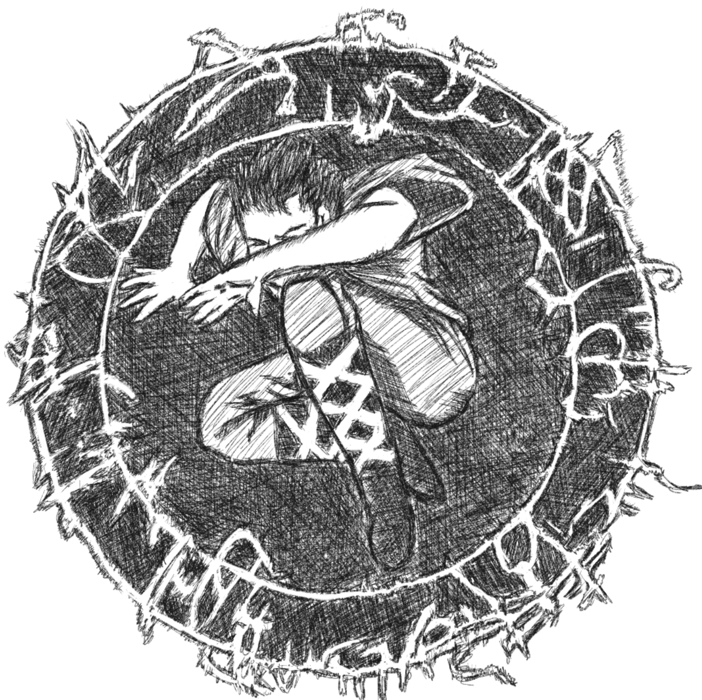

***I used to play a lot of Magic: The Gathering trading card game, wherein I tend to reflect today's blog with one of it's famous basic cards called the circle of protection...***

I'd like to think that a truthful argument can cut through numerous systems of interpreting the world. This has been a great addition to my arsenal in navigating difficult decisions, understanding people and societal mediocrity. 

The circle of protection is played by paying a fairly decent cost of mana and have a significant defense to any kind of sorcery, creature or spell in the realm of magic. This places a player when he plays the right protection at the right moment as he could technically nullify any bad effects however strong it may be. This idea is what I relate to knowing a lot of correlated frames of understanding from science to art to coding to philosophy - this makes one understand more and maximize time more effectively. 

The value of time spent is very underrated. Not regretting and understanding the past, thriving continously in the present and placing superior importance on what I can be in the future - maximizes usage of finite time that has been allowed to as for habit and relationship building and creating or contributing to the greater good. 

The cost of learning at present is zero due to the surge of internet powered intellectual resources and conversations. All trends skyrocket upward as far as innovation and processing powers of smartphones and computers. Abundance is the main problem now as there is too much information that is hard to distinguish if its truthful or not. The need of a value system is becoming more important as it is becoming more and more easier to become addictive with social media or video games and increase unecessary weight gain or acquire diabities with over consuming sugars and carbohydrates. 

Physics explains how fragile the universe is which includes us, Stoicism aspires self-control in the times of extreme chaos, technology makes the future somewhat visible, psychology and neuroscience teaches our humang capabilities, biology explains our connection to the plants, animals and the stars, history reminds us of our hellish path to the present times and focusing on individual responsibility is the path to acquiring competence and becoming a better human being.

The truthful person is becoming more and more rarer as the world is becoming engulfed with the over flowing layer of dopamine and cortisol wrapped in satelites and fiber optic cables - information abundance is the double edge sword in my view point. The average person is incapable of understanding his connection to the stars due to the fact that he or she chooses to spend his / her finite time scrolling a black mirror.
