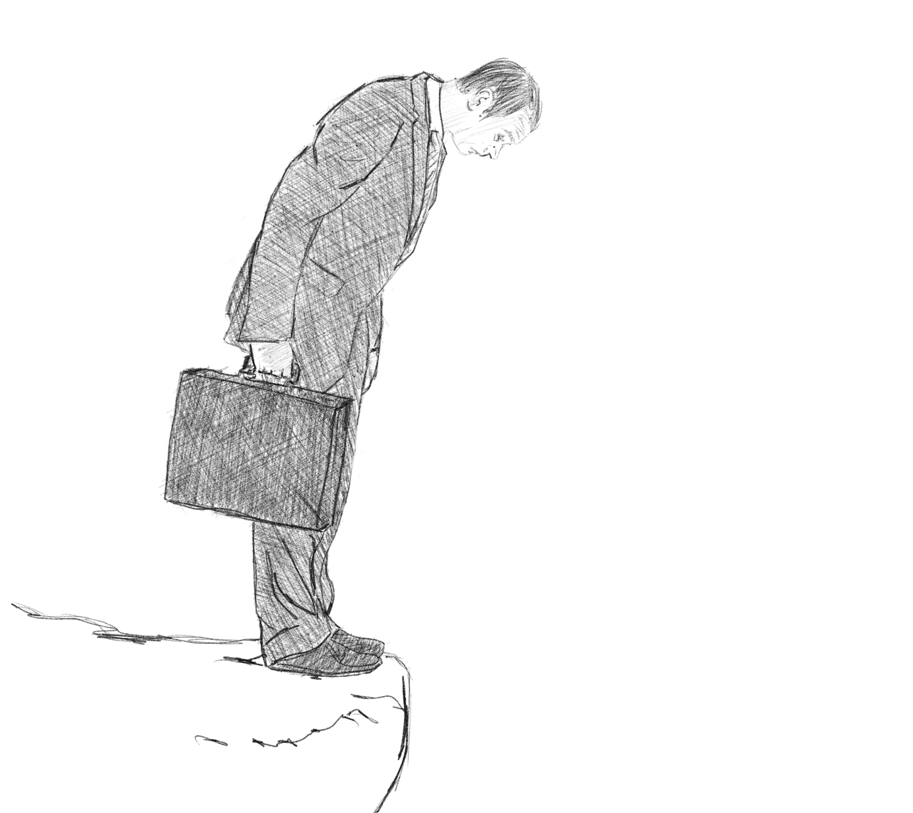

***I'm kind of obsessed on how to maximize time the little time I have in my life...moreover gone across the depths of science and the universe just to understand the valuable resource not most of us understand..***

This is a good metric of where time is...lifespans of some significant things that revolve our lives:
* Single use plastics - 1 day to a week
* Smartphones - 2.5 years
* Dogs - 10 to 13 years
* Cats - 2 to 16 years
* Car -  8 to 15 years
* Gorillas - 35 to 40 years
* Humans - 79 years 
* Nile Crocodiles - 70 to 100 years
* Cast iron sewer pipes - 75 to 100 years
* High quality wooden cabinets - up to 50 years
* Earth - 4.5 billion years
* The Sun - 4.5 billion years
* The Universe - 13.78 billion years

So I have 39 more years if I manage to survive the average age. Though I wanted to live longer than 39 years, well it is rather very difficult to compete with my own biological clock. And who am I to question the magnificent structure of the universe. Very grateful to even have the ability to write blogs and make sense of the experience living in it. 

The right path moving forward is to accept that our time should be well spent, every second of it should be put into the greatest experience that the cup of life enabled us. Each interaction should be well articulated. Listen with silent ears across the noise. Taste even the unfortunate events that fate bestow us. Live life on the edge, because there is no alternative in my opinion. 